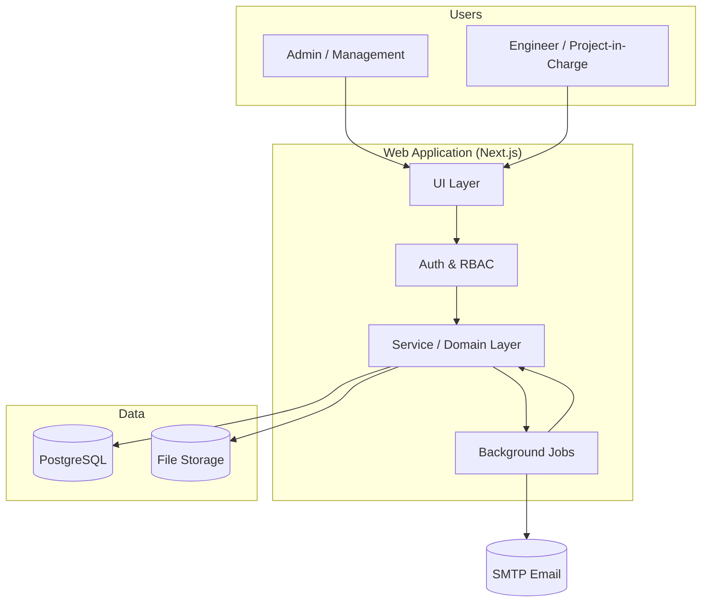

# Project Management, Tracking & Inventory System (PMTIS)

A custom internal web application for a construction and engineering firm. It centralizes
project monitoring, daily site reporting, inventory and material traceability, budget /
expense / cash-flow tracking, approvals, email notifications, reports, and dashboards.

> **This repository currently contains planning documentation only.** No application code
> has been written yet. These documents are the technical blueprint the build will follow.

**Decided stack:** Next.js 16 (App Router · Server Actions · Cache Components) · TypeScript ·
Neon Postgres + **Drizzle** · **Better Auth** · Tailwind v4 + shadcn + Lucide · Zod ·
**Resend + React Email** · **Cloudflare R2** · Vercel Cron — on Vercel Fluid Compute.
Rationale & gotchas in [docs/16-tech-decisions.md](docs/16-tech-decisions.md).

---

## How to read these docs

Read them roughly in order. The first four establish the foundation everything else
depends on; the rest can be read as needed.

| #   | Document                                                       | What it covers                                                              |
| --- | -------------------------------------------------------------- | --------------------------------------------------------------------------- |
| 00  | [Overview & Glossary](docs/00-overview.md)                     | Vision, scope, personas, terminology, naming conventions                    |
| 01  | [Architecture](docs/01-architecture.md)                        | Tech stack, system layers, project structure, deployment, security baseline |
| 02  | [Data Model](docs/02-data-model.md)                            | Entities, relationships, ERD, table-by-table field reference                |
| 03  | [Roles & Permissions](docs/03-roles-and-permissions.md)        | RBAC model, permission matrix, access rules                                 |
| 04  | [Module Specifications](docs/04-modules.md)                    | Detailed spec for all 21 functional modules                                 |
| 05  | [Core Flows](docs/05-core-flows.md)                            | End-to-end process flows (project, inventory, finance, notification)        |
| 06  | [Inventory Ledger & Traceability](docs/06-inventory-ledger.md) | The append-only stock ledger, balances, movement types                      |
| 07  | [Finance Design](docs/07-finance-design.md)                    | Budget vs actual, expenses, cash flow, money math                           |
| 08  | [Notifications & Email](docs/08-notifications.md)              | Event model, SMTP delivery, templates, scheduling                           |
| 09  | [Reports & Export](docs/09-reports-and-export.md)              | Report catalog, query strategy, PDF/Excel/CSV export                        |
| 10  | [Dashboard](docs/10-dashboard.md)                              | Summary cards, widgets, data sources, performance                           |
| 11  | [API Design](docs/11-api-design.md)                            | Endpoint conventions, resource map, validation, errors                      |
| 12  | [Audit Trail](docs/12-audit-trail.md)                          | What gets logged, schema, write strategy                                    |
| 13  | [Non-Functional Requirements](docs/13-non-functional.md)       | Security, performance, backups, file storage, observability                 |
| 14  | [Implementation Roadmap](docs/14-implementation-roadmap.md)    | The 5 stages broken into buildable tasks with acceptance criteria           |
| 15  | [Future Enhancements](docs/15-future-enhancements.md)          | Extensibility guide and a backlog of post-v1 features                       |
| 16  | [Tech Decisions](docs/16-tech-decisions.md)                    | **Locked stack**, rationale, integration notes & gotchas                    |
| 17  | [Audit Decisions](docs/17-audit-decisions.md)                  | **Post-audit resolutions** — supersede conflicting details in 00–16         |

---

## The system in one diagram

---

## Scope at a glance

Six functional areas, 21 modules, 2 user roles, built in 5 stages.

- **Core System** — Auth, Audit Trail, System Settings, Notifications
- **Directory** — Employees/Workforce, Clients, Suppliers
- **Projects** — Project Management, Phases & Tasks, Daily Site Reports
- **Finance** — Budget & Expenses, Cash Flow, Approvals
- **Inventory** — Master Data, Stock-In, Material Requests, Release & Site Receiving, Movements & Adjustments, Traceability/Ledger
- **Management Output** — Reports & Export, Dashboard

See [00-overview.md](docs/00-overview.md) for the full picture.
