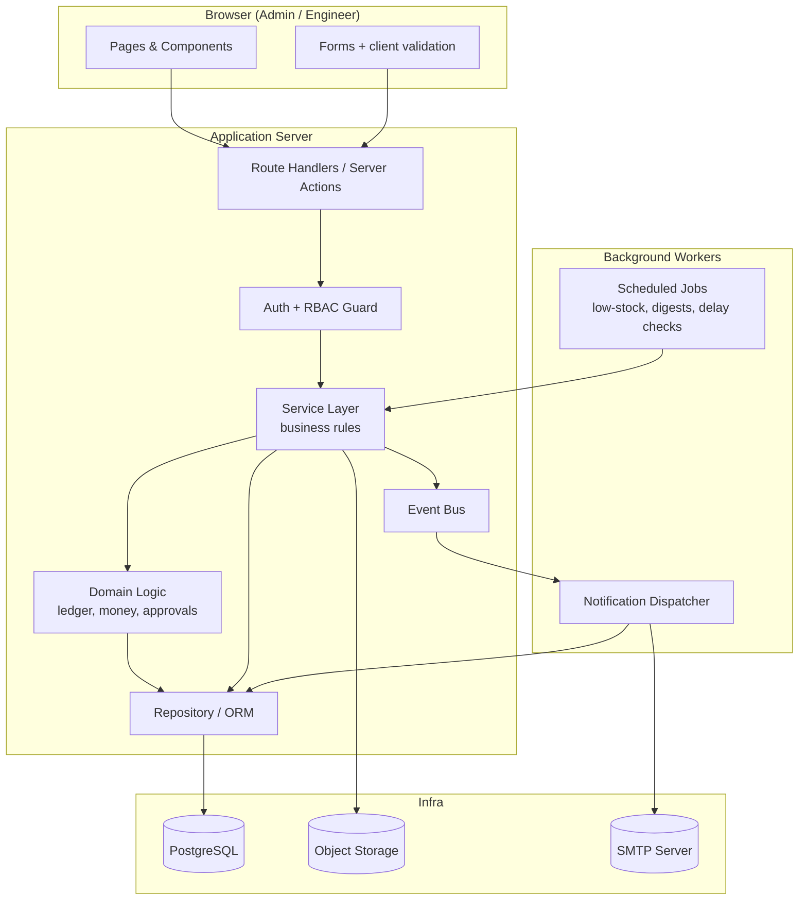
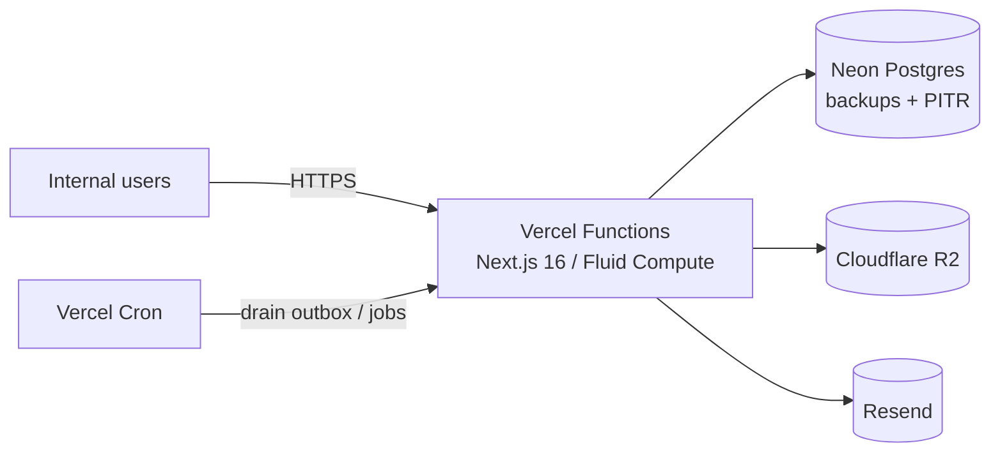

# 01 — Architecture

## 1. Architectural goals

- **Relational integrity first.** Inventory traceability and finance are accounting-grade
  problems. The data store must enforce referential integrity and support transactions.
- **Layered, not tangled.** UI → API/Service → Domain → Data. Business rules live in the
  service/domain layer, never in components or SQL only.
- **Attributable & auditable.** Every write knows who did it; sensitive writes are logged.
- **Swappable edges.** Email provider, file storage, and even the web framework are behind
  interfaces so they can change without touching domain logic.
- **Boring and maintainable.** This is an internal tool that must run for years with light
  maintenance. Favor well-understood, well-documented technology over novelty.

## 2. Recommended reference stack

This is the concrete stack the implementation guide is written against. It is a
recommendation, not a mandate — the layering below means most pieces can be swapped.

This is the **decided** stack (see [16-tech-decisions.md](16-tech-decisions.md) for rationale and
integration gotchas). The layering below keeps most pieces swappable.

| Concern | Decision | Why |
|---------|----------|-----|
| Hosting | **Vercel (managed)** | Fluid Compute (Node 24), 300s timeouts, warm instances |
| Language | **TypeScript** (end to end) | One language, strong typing for finance/inventory math |
| Web framework | **Next.js 16** (App Router, Server Actions, Cache Components) | Server + UI together; PPR for dashboard UX |
| UI | **React + Tailwind v4 + shadcn + Lucide** | Fast, consistent, accessible; forms/tables-heavy |
| Tables / forms | **TanStack Table + react-hook-form + Zod** | Data grids + forms sharing Zod with Server Actions |
| Data layer | **Neon Postgres** (Vercel Marketplace) | Transactions, constraints, views, analytical SQL |
| ORM | **Drizzle ORM + Drizzle Kit** | Cross-project consistency; SQL-first suits ledger/reports |
| Auth | **Better Auth** (Drizzle adapter) | Email/password + DB sessions; admin-provisioned; RBAC is a static code map ([17](17-audit-decisions.md) §1), not DB tables |
| File storage | **Cloudflare R2** (S3-compatible) | Cross-project consistency; presigned uploads |
| Email | **Resend + React Email** | Transactional email; type-safe React templates (SMTP endpoint available) |
| Background jobs | **Vercel Cron + DB outbox/job table** | Notifications, low-stock, delay checks, digests, reconciliation |
| Validation | **Zod** | One schema for API/form validation + types |
| PDF export | **React-PDF** | Report exports |
| Excel/CSV | **ExcelJS** / **csv-stringify** | Report exports |
| Charts | **Recharts** | Dashboard widgets |
| Testing | **Vitest** (unit) + **Playwright** (e2e) | Confidence on critical flows |

> **The non-negotiables** (true on any stack): a relational DB **with multi-statement
> transactions** (the ledger depends on this — see the driver note in §5.2), server-side business
> rules, an append-only ledger, and transactional email. The *entire data model, module specs,
> flows, and roadmap still apply unchanged* — only library names differ.

## 3. System layers



### Layer responsibilities

| Layer | Responsibility | Must NOT |
|-------|----------------|----------|
| **UI / Components** | Render, collect input, optimistic feedback, client-side validation | Contain business rules or DB queries |
| **Route Handlers / Server Actions** | Authenticate, authorize, parse + validate input (Zod), call service, shape response | Contain domain logic |
| **Service Layer** | Orchestrate a use case (e.g. "approve material request"), manage transactions, emit events | Know about HTTP or React |
| **Domain Logic** | Pure rules: ledger posting, balance math, money math, approval state machine | Touch the network or framework |
| **Repository / ORM** | Read/write rows, enforce constraints | Make business decisions |
| **Event Bus** | Decouple "something happened" from "send an email" | Block the request path |
| **Workers** | Run async/scheduled work | Be the only path for critical writes |

## 4. Recommended project structure

```
project-management-system/
├─ docs/                      # these planning documents
├─ drizzle/
│  └─ migrations/             # Drizzle Kit migrations (generated)
├─ drizzle.config.ts          # Drizzle Kit config (uses DATABASE_URL_UNPOOLED)
├─ src/
│  ├─ db/
│  │  ├─ schema/              # Drizzle table definitions (the data model, see docs/02)
│  │  ├─ client.ts            # Drizzle client (transaction-capable driver — see §5.2)
│  │  └─ seed.ts              # master data + first admin user
│  ├─ app/                    # Next.js routes (UI + API)
│  │  ├─ (auth)/login/
│  │  ├─ (app)/dashboard/
│  │  ├─ (app)/projects/
│  │  ├─ (app)/inventory/
│  │  ├─ (app)/finance/
│  │  ├─ (app)/reports/
│  │  ├─ (app)/settings/
│  │  └─ api/                 # route handlers (see docs/11)
│  ├─ modules/               # one folder per domain area
│  │  ├─ projects/
│  │  │  ├─ service.ts        # use cases
│  │  │  ├─ domain.ts         # rules
│  │  │  ├─ schema.ts         # Zod validators
│  │  │  └─ queries.ts        # read queries
│  │  ├─ inventory/
│  │  ├─ finance/
│  │  ├─ approvals/
│  │  ├─ notifications/
│  │  ├─ directory/
│  │  ├─ reports/
│  │  └─ audit/
│  ├─ emails/                 # React Email templates
│  ├─ lib/
│  │  ├─ auth.ts              # Better Auth config + session/RBAC helpers
│  │  ├─ rbac.ts              # permission definitions
│  │  ├─ events.ts            # event bus (also drives cache invalidation)
│  │  ├─ mailer.ts            # Resend transport + React Email render
│  │  ├─ storage.ts           # Cloudflare R2 (S3) adapter + presigned URLs
│  │  ├─ money.ts             # money helpers
│  │  └─ refcodes.ts          # MR-2026-00042 generators
│  ├─ components/             # shared UI (design system)
│  └─ workers/                # scheduled + queued jobs
├─ .env.example
└─ README.md
```

> The `modules/` folder mirrors the functional areas in these docs. Each module owns its
> service, domain rules, validators, and read queries. Cross-module calls go **service →
> service**, never reaching into another module's internals.

## 5. Key technical decisions

### 5.1 Server-side business rules
All state changes (releasing stock, approving an expense, posting a ledger movement) run on
the server inside a database transaction. The browser never computes balances or trusts
client-sent totals.

### 5.2 Transactions around multi-row operations
Operations that touch several tables must be atomic. Example — approving a material request
and releasing stock writes: a `releases` row, N `release_lines`, N `stock_ledger` entries,
N `item_stock_balances` updates, an `approvals` update, and an `audit_logs` row. All succeed
or all roll back.

> **⚠️ Driver note (Neon + Drizzle).** This atomicity requires a **transaction-capable driver**.
> Use `drizzle-orm/postgres-js` (pooled Neon connection) or `drizzle-orm/neon-serverless`
> (WebSocket pool) — both support `db.transaction()`. Do **not** use `drizzle-orm/neon-http`,
> which cannot run interactive multi-statement transactions. The ledger silently breaks without
> this. Also set `postgres({ prepare: false })` on the pooled (PgBouncer) connection. See
> [16-tech-decisions.md](16-tech-decisions.md) §2.

### 5.3 The ledger pattern (see [06](06-inventory-ledger.md))
Stock is **never** stored as a single mutable number that gets `+`/`-` directly. Every change
is an append-only `stock_ledger` row with a signed quantity. The current balance is the sum
of the ledger (cached in `item_stock_balances` for speed, rebuildable from the ledger). This
gives free, tamper-evident traceability.

### 5.4 Event-driven notifications (see [08](08-notifications.md))
Services emit domain events (`material_request.approved`, `task.delayed`, `stock.low`). A
dispatcher maps events → recipients → templates → SMTP, honoring per-event notification
settings. Email failures are retried and never break the originating action.

### 5.5 Soft delete where history matters
Master data (clients, suppliers, items, employees, users) is **soft-deleted** (`deleted_at`)
so historical transactions keep referencing them. Transactional records are generally not
deleted at all — they are cancelled/reversed.

### 5.6 Reference codes
Human-friendly, sequential, year-scoped codes (`MR-2026-00042`) generated server-side via a
dedicated counter table to avoid race conditions. Never reused, even after cancellation.

### 5.7 File handling
Uploads go straight to object storage; the DB stores metadata (key, filename, mime, size,
uploaded_by). Access is via signed/expiring URLs. Allowed types and size limits enforced
server-side. See [13-non-functional.md](13-non-functional.md) §4.

## 6. Environments

| Environment | Purpose | Notes |
|-------------|---------|-------|
| **Local** | Development | Local/Neon-branch Postgres + R2 dev bucket + Resend test key |
| **Staging (Preview)** | UAT / client review | Vercel Preview; safe test data; Resend to a test inbox |
| **Production** | Live use | Backups on, monitoring on, restricted access |

Configuration is entirely via environment variables (see `.env.example`). No secrets in code.
Minimum required env keys:

```
DATABASE_URL=            DATABASE_URL_UNPOOLED=     # Neon: pooled for app, direct for migrations
BETTER_AUTH_SECRET=      BETTER_AUTH_URL=
RESEND_API_KEY=          EMAIL_FROM=                # verified sending domain
R2_ENDPOINT=  R2_ACCESS_KEY_ID=  R2_SECRET_ACCESS_KEY=  R2_BUCKET=
CRON_SECRET=
APP_TIMEZONE=   APP_BASE_URL=   APP_CURRENCY=
```

Full annotated list in [16-tech-decisions.md](16-tech-decisions.md) §8.

## 7. Deployment topology

A simple, robust topology suited to an internal tool:



- **App hosting:** Vercel (Fluid Compute, Node 24). Server Actions + route handlers run as
  Functions; no separate server to operate.
- **Database:** Neon Postgres via the Vercel Marketplace, with automated backups and
  point-in-time recovery. This is the most important thing to get right operationally.
- **Files:** Cloudflare R2 (S3-compatible); browser uploads go direct via presigned URLs.
- **Email:** Resend (verified sending domain; delivery status via webhooks).
- **Scheduler:** Vercel Cron hitting protected (`CRON_SECRET`) endpoints that drain the
  notification outbox and run digests, delay checks, low-stock scans, and ledger reconciliation
  ([16](16-tech-decisions.md) §6).
- **TLS everywhere.** Internal does not mean unencrypted.

## 8. Security baseline (summary — full detail in [13](13-non-functional.md))

- Passwords hashed by Better Auth (scrypt), HTTP-only secure session cookies, CSRF protection on
  mutations.
- Authorization checked **server-side on every request** — never rely on hidden UI.
- Engineers are scoped to their assigned projects at the **query level**, not just the UI.
- All input validated with Zod at the boundary; parameterized queries via the ORM (no string
  SQL).
- Rate-limit auth endpoints. Lock/inactivate accounts rather than deleting.
- Audit log for sensitive actions (see [12](12-audit-trail.md)).
- Mutation endpoints are idempotent or guarded so a double-click can't create duplicates
  (matches the firm's form-submission safety rule).
