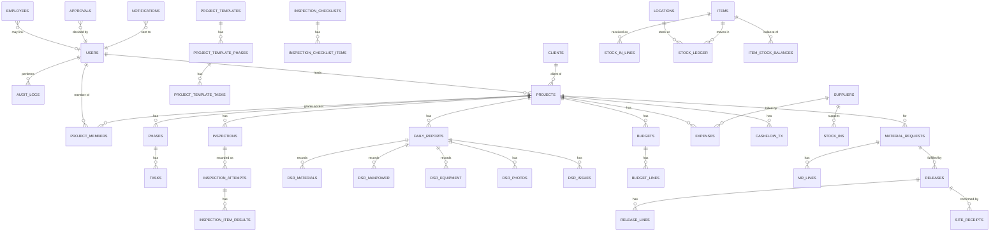

# 02 — Data Model

This is the canonical entity reference. Field tables use logical types; map them to your DB
(Postgres types shown in parentheses where useful). Conventions from
[00-overview.md](00-overview.md) §7 apply (snake_case, plural tables, `id` PK, `created_at`,
etc.).

Legend for field tables: **PK** primary key · **FK** foreign key · **U** unique · **N**
nullable · **idx** indexed.

---

## 1. Entity map (high level)

> Not every relationship is drawn (it would be unreadable). The field tables below are
> authoritative.

---

## 2. Core System

### 2.1 `user` (Better Auth–owned)
The login accounts. **Better Auth owns this table** (singular name, **text** ids) along with
`session`/`account`/`verification`; the password hash lives in **`account.password`** (Better Auth
scrypt), never here ([17](17-audit-decisions.md) §3). Domain code only extends it with
`role`/`is_active`/`employee_id`/`deleted_at`. Source of truth: `src/db/schema/auth.ts`.

| Field | Type | Notes |
|-------|------|-------|
| id | text **PK** | Better Auth id (text, **not** uuid); every domain FK references it |
| email | text **U** **idx** | login identifier |
| name | text | |
| email_verified | boolean | |
| role | text | `ADMIN` / `ENGINEER` (+ hidden `WEBMASTER`, [03](03-roles-and-permissions.md)); plain text, validated in code |
| is_active | boolean | inactive users can't log in; deactivation also revokes sessions |
| employee_id | text **N** | optional link to the directory |
| banned / ban_reason / ban_expires | boolean / text / timestamp **N** | Better Auth admin plugin |
| created_at / updated_at | timestamp | |
| deleted_at | timestamp **N** | domain soft-delete (archive) |

### 2.2 Roles & permissions — **static code map, not tables** ([17](17-audit-decisions.md) §1)
RBAC is code-owned: the `ROLE_PERMISSIONS` map in `src/lib/permissions.ts` (roles `ADMIN`/`ENGINEER`/`QA_QC_ENGINEER`
+ hidden `WEBMASTER` in `src/lib/roles.ts`). There are **no** `permissions`/`role_permissions` DB
tables in v1.

> The permission **keys** are the stable contract (defined from day one). Graduating to
> `permissions(id, key, description)` + `role_permissions(role, permission_id)` tables later — when an
> admin-editable role is needed — is purely additive and needs no guard changes.

### 2.3 `audit_logs` (see [12](12-audit-trail.md)) — source: `src/db/schema/audit-logs.ts`

| Field | Type | Notes |
|-------|------|-------|
| id | uuid **PK** | |
| actor_id | text **FK→user** **N** **idx** | null for system actions (Better Auth text id) |
| action | text **idx** | e.g. `project.updated` |
| entity_type | text **idx** | e.g. `project` |
| entity_id | text **idx** **N** | affected row id — **text**, not uuid: ids are heterogeneous (Better Auth `user` is text; domain rows are uuid). Refines [17](17-audit-decisions.md) §4 for this column. |
| summary | text | human-readable line |
| diff | jsonb **N** | before/after for key fields |
| created_at | timestamp **idx** | |

> Append-only — a `BEFORE UPDATE OR DELETE` trigger blocks mutation ([12](12-audit-trail.md)).

### 2.4 System Settings

> **Option lists are fixed in code, not lookup tables** ([17](17-audit-decisions.md) §9, which
> supersedes the prior `*_statuses` / `units` / `*_categories` / `employee_trades` tables). State
> machines code branches on are `pgEnum`; descriptive labels (units, trades, categories) are TS
> const maps + a `text` code column (`src/lib/lookups.ts`); task/phase status is derived from
> progress (`src/lib/statuses.ts`). There are **no** `*_id` FKs into option-list tables.

Admin-editable configuration store (the only settings that stay editable at runtime):
- `app_settings(key U, value jsonb)` — timezone, currency, company info, SMTP defaults toggle,
  reorder behavior, etc.
- `notification_settings` — see [08](08-notifications.md).

---

## 3. Directory

### 3.1 `employees` (Workforce Directory)

| Field | Type | Notes |
|-------|------|-------|
| id | uuid **PK** | |
| full_name | string **idx** | |
| trade_code | text **N** | `TRADES` (`src/lib/lookups.ts`); no FK |
| phone / email | string **N** | |
| is_active | boolean | inactive = no longer on the directory ([17](17-audit-decisions.md) §9) |
| notes | text **N** | |
| created_at / updated_at / deleted_at | | |

> Employees are a reference list (who reported, who received, who worked on site). Not every
> employee is a system user; a user may link to an employee via `users.employee_id`.

### 3.2 `clients`

| Field | Type | Notes |
|-------|------|-------|
| id | uuid **PK** | |
| name | string **idx** | |
| contact_person / phone / email / address | string **N** | |
| notes | text **N** | |
| created_at / updated_at / deleted_at | | |

Documents and notes are **polymorphic** ([17](17-audit-decisions.md) §1): `attachments`
(`entity_type='client'` → `files`) and `notes` (`entity_type='client'`) — no per-entity
`client_documents`/`client_notes` tables. Project history is derived (projects where `client_id`
matches).

### 3.3 `suppliers`

| Field | Type | Notes |
|-------|------|-------|
| id | uuid **PK** | |
| name | string **idx** | |
| contact_person / phone / email / address | string **N** | |
| tin / payment_terms | string **N** | |
| notes | text **N** | |
| created_at / updated_at / deleted_at | | |

---

## 4. Projects

### 4.1 `projects`

| Field | Type | Notes |
|-------|------|-------|
| id | uuid **PK** | |
| ref_code | string **U** | e.g. `PRJ-2026-0007` |
| name | string **idx** | |
| client_id | uuid **FK→clients** **idx** | |
| location | string **N** | site address |
| contract_amount | money | |
| start_date / target_end_date | date **N** | |
| actual_end_date | date **N** | set on completion |
| scope_of_work | text **N** | |
| lead_engineer_id | uuid **FK→user** **idx** | the *named* lead engineer (display). **Access is granted by `project_members`, not this column** ([17](17-audit-decisions.md) §10.1) |
| status | enum(`PLANNING`,`ACTIVE`,`ON_HOLD`,`COMPLETED`,`CANCELLED`) **idx** | `pgEnum`; manual lifecycle ([17](17-audit-decisions.md) §9) |
| defects_liability_until | date **N** | warranty/retention period end; "In Warranty" is derived, not stored |
| progress_pct | decimal(5,2) | 0–100; **stored, recomputed on write** as the roll-up of phases ([17](17-audit-decisions.md) §10.3) unless pinned |
| progress_is_manual | boolean (default false) | pins `progress_pct` to a manual value and stops the roll-up |
| created_by | uuid **FK→user** | |
| created_at / updated_at / deleted_at | | |

**`project_members`** (the access grant — [17](17-audit-decisions.md) §10.1, ships in Stage 2):

| Field | Type | Notes |
|-------|------|-------|
| project_id | uuid **FK→projects** | part of **U(project_id, user_id)** |
| user_id | uuid **FK→user** **idx** | **idx(user_id, project_id)** backs the engineer-scope predicate |
| role_on_project | text | `LEAD` / `MEMBER` / `INSPECTOR` — drives lead-vs-member notification targeting ([17](17-audit-decisions.md) §10.8). `INSPECTOR` is added by the (post-Stage-2) inspection request to grant a QA/QC engineer scoped access (§4.5, [17](17-audit-decisions.md) §10) |
| created_at | timestamp | |

A project carries **one `LEAD` + many `MEMBER`** engineers — the join already models the full
team, so the Stage 2 UI assigns a lead **plus** member engineers, not a single person.
`lead_engineer_id` above is only the *named display lead*; capability comes from the user's
**role**, not from `role_on_project`.

Documents attach via the polymorphic **`attachments`** table (`entity_type = 'project'`,
[17](17-audit-decisions.md) §1) — not a per-entity `project_documents` table.

### 4.2 `phases`

| Field | Type | Notes |
|-------|------|-------|
| id | uuid **PK** | |
| project_id | uuid **FK→projects** **idx** | |
| name | string | |
| sequence | int | ordering |
| start_date / target_end_date | date **N** | |
| progress_pct | decimal(5,2) | weighted avg of tasks; **stored, recomputed on each task write** ([17](17-audit-decisions.md) §10.3) |
| remarks | text **N** | |

> Status is **derived, not stored** ([17](17-audit-decisions.md) §9): `deriveProgressStatus`
> (0 → Not Started, 1–99 → In Progress, 100 → Done); `is_delayed` derived from `target_end_date`.

### 4.3 `tasks`

| Field | Type | Notes |
|-------|------|-------|
| id | uuid **PK** | |
| phase_id | uuid **FK→phases** **idx** | |
| name | string | |
| assignee_id | uuid **FK→user** **N** | |
| start_date / due_date | date **N** | |
| completed_date | date **N** | set when progress_pct hits 100 |
| progress_pct | decimal(5,2) | **the single input** (status derives from it) |
| is_blocked | boolean | orthogonal overlay, not a status |
| blocked_reason | text **N** | required when `is_blocked` |
| is_delayed | boolean | **stored transition flag**, written only by the daily delay job ([17](17-audit-decisions.md) §10.7); the read path derives the same condition for live display |
| remarks | text **N** | |

> Status is **derived, not stored** ([17](17-audit-decisions.md) §9): `deriveProgressStatus`
> (0 → Not Started, 1–99 → In Progress, 100 → Done). Blocked/Delayed are flags shown alongside.

Attachments via the polymorphic **`attachments`** table (`entity_type = 'task'`,
[17](17-audit-decisions.md) §1) — no separate `task_attachments` table.

### 4.4 Daily Site Reports
`daily_reports`

| Field | Type | Notes |
|-------|------|-------|
| id | uuid **PK** | |
| ref_code | string **U** | `DSR-2026-00231` |
| project_id | uuid **FK→projects** **idx** | |
| report_date | date **idx** | one per project per day (U: project_id+report_date) |
| weather | string **N** | |
| work_accomplished | text | |
| next_day_plan | text **N** | |
| progress_note | text **N** | |
| submitted_by | uuid **FK→user** | |
| submitted_at | timestamp | |
| status | enum(`DRAFT`,`SUBMITTED`) | |

Children:
- `dsr_manpower(id, daily_report_id FK, employee_id FK N, trade_code text N, headcount int, hours decimal N)`
- `dsr_equipment(id, daily_report_id FK, name, quantity, hours decimal N, remarks N)`
- `dsr_materials(id **uuid PK — stable**, daily_report_id FK, item_id FK N, description N, quantity decimal, unit_code text N)` — **drives "used" in issued/used/remaining**; the `id` is the Stage-3 ledger's `source_id` for line-level reversal, and edits to a submitted DSR are **new rows** ([17](17-audit-decisions.md) §10.4)
- `dsr_photos(id, daily_report_id FK, file_id FK, caption N)`
- `dsr_issues(id, daily_report_id FK, description, severity enum, resolved boolean)`

> `dsr_materials` is the bridge between site reporting and inventory accounting. When an item is
> linked it counts toward material *usage*; on submit the Stage-3 ledger posts a `−USAGE` row
> carrying `source_id = dsr_materials.id`, so a re-opened DSR reverses the exact rows
> ([17](17-audit-decisions.md) §10.4, [06](06-inventory-ledger.md) §6). Stage 2 reserves the link; Stage 3 wires the posting.

### 4.5 Inspections (implemented) — `src/db/schema/inspections.ts`

A project-scoped QA/QC record on its own **Inspections** tab — NOT bound to a task or phase.
An engineer raises a **request** naming a QA/QC engineer (which grants that user `INSPECTOR`
membership so they can open the project; **no request → no membership → 404**, the engineer-scope
invariant holds). The QA/QC engineer picks a **preset checklist at inspection time** (§4.5.1),
records each item PASS/FAIL/N-A (+remarks, +optional photos), and **sets the overall PASS/FAIL
themselves** — items are evidence, never an auto-gate. Advisory: an outcome never gates
task/project completion ([04](04-modules.md) §5.10a, [17](17-audit-decisions.md) §10).

`inspections`

| Field | Type | Notes |
|-------|------|-------|
| id | uuid **PK** | |
| ref_code | string **U** | `INS-2026-00042` (server-side counter) |
| project_id | uuid **FK→projects** **idx** | |
| title | text | what's being inspected |
| area / description | text **N** | |
| scheduled_for | date **N** | |
| inspector_id | **text** **FK→user** **N** **idx** | the QA/QC engineer (Better Auth text id); named at request time |
| requested_by_id | **text** **FK→user** **N** | the engineer raising the request |
| checklist_id | uuid **FK→inspection_checklists** **N** | preset chosen by QA/QC at inspection time; **null = free-form** pass/fail (today's behavior) |
| status | enum(`REQUESTED`,`PASSED`,`FAILED`) **idx** | the **denormalized latest** outcome; default `REQUESTED` |
| outcome_remarks | text **N** | latest overall remarks |
| requested_at | timestamp | |
| inspected_at | timestamp **N** | set when the first/any outcome is recorded |
| created_at / updated_at / deleted_at | | soft-delete = **withdrawn** (only allowed while `REQUESTED`) |

**Re-inspection = reopen in place, never a new request** ([17](17-audit-decisions.md) §10.16).
A FAILED inspection is re-inspected on the same record; **every recording appends an
`inspection_attempts` row** and the inspection's `status`/`outcome_remarks` reflect the latest.
This avoids forcing a full re-request when only one of several items failed, while keeping a full
attempt timeline.

`inspection_attempts` (the append-only history log; one row per recording)

| Field | Type | Notes |
|-------|------|-------|
| id | uuid **PK** | |
| inspection_id | uuid **FK→inspections** (cascade) **idx** | |
| attempt_no | int | 1-based, server-assigned (`max+1` in-tx) |
| outcome | enum(`PASSED`,`FAILED`) | the overall call the QA/QC set for this attempt |
| remarks | text **N** | overall remarks for this attempt |
| recorded_by_id | **text** **FK→user** **N** | the QA/QC engineer who recorded it |
| recorded_at / created_at | timestamp | |

`inspection_item_results` (per-attempt snapshot of the checklist)

| Field | Type | Notes |
|-------|------|-------|
| id | uuid **PK** | |
| attempt_id | uuid **FK→inspection_attempts** (cascade) **idx** | |
| label | text | **snapshot** of the checklist item label so later preset edits never rewrite history |
| result | enum(`PASS`,`FAIL`,`NA`) | the per-item call (`INSPECTION_ITEM_RESULTS`, `src/lib/statuses.ts`) |
| remarks | text **N** | |
| sequence | int | display order |

Per-item **photos** attach via the polymorphic **`attachments`** table
(`entity_type = 'inspection_item_result'`, `entity_id = result.id`) over R2 — no per-inspection
photo table.

#### 4.5.1 Preset checklists (admin reference data — Setup → Checklists)

Authored by admins; the QA/QC engineer selects one (by `category`) at inspection time. Items are
**copied (snapshotted)** onto each attempt, so editing a preset never alters a recorded inspection.

`inspection_checklists`

| Field | Type | Notes |
|-------|------|-------|
| id | uuid **PK** | |
| name | string **idx** | |
| category | text **N** | grouping for the picker (e.g. Concrete, Electrical) |
| description | text **N** | |
| is_active | boolean | inactive = hidden from the inspection picker |
| created_by | **text** **FK→user** | |
| created_at / updated_at / deleted_at | | |

`inspection_checklist_items`

| Field | Type | Notes |
|-------|------|-------|
| id | uuid **PK** | |
| checklist_id | uuid **FK→inspection_checklists** (cascade) **idx** | |
| label | text | the line the inspector marks PASS/FAIL/N-A |
| guidance | text **N** | what to look for |
| sequence | int | ordering |
| created_at / updated_at | | |

### 4.6 Project Templates — `src/db/schema/project-templates.ts`

Admin-authored skeletons of **phases** (each with a *duration in days*) and **tasks** (name +
weight). Creating a project **from a template** computes a **sequential calendar-day schedule**
from a single project start date — phase 1 starts on the project start; each next phase the day
*after* the prior phase's computed end (`end = start + duration − 1`, inclusive) — surfaced in a
**review step where per-phase durations are adjustable before any rows are written**
([04](04-modules.md) §5.8a, [17](17-audit-decisions.md) §10.17). **Snapshot semantics:** the cloned
phases/tasks are an independent copy — editing the project never touches the template, and vice
versa. Tasks carry **no dates** (phase-level scheduling only, v1).

`project_templates`

| Field | Type | Notes |
|-------|------|-------|
| id | uuid **PK** | |
| name | string **idx** | |
| description | text **N** | |
| is_active | boolean | inactive = hidden from the "Start from template" picker |
| created_by | **text** **FK→user** | |
| created_at / updated_at / deleted_at | | |

`project_template_phases`

| Field | Type | Notes |
|-------|------|-------|
| id | uuid **PK** | |
| template_id | uuid **FK→project_templates** (cascade) **idx** | |
| name | string | |
| sequence | int | ordering |
| duration_days | int | default 7; **calendar** days; chained at instantiation, adjustable at the review step (validated ≥ 1) |
| created_at / updated_at | | |

`project_template_tasks`

| Field | Type | Notes |
|-------|------|-------|
| id | uuid **PK** | |
| template_phase_id | uuid **FK→project_template_phases** (cascade) **idx** | |
| name | string | |
| sequence | int | ordering |
| weight_pct | decimal(5,2) | task's share of the phase (0–100); copied verbatim to `tasks.weight_pct` |
| created_at / updated_at | | |

Instantiation inserts the project's `phases` (`target_start_date`/`target_end_date` from the
chain; actuals null; `progress_pct` 0) and their `tasks` (name + weight + sequence) in **one
transaction** via the shared `instantiateTemplate` service.

---

## 5. Finance (detail in [07](07-finance-design.md))

### 5.1 `budgets`
One active budget per project (versioned via `version`).

| Field | Type | Notes |
|-------|------|-------|
| id | uuid **PK** | |
| project_id | uuid **FK→projects** **idx** | |
| version | int | bump on revision |
| status | enum(`DRAFT`,`ACTIVE`,`SUPERSEDED`) | |
| total_amount | money | sum of lines (cached) |
| notes | text **N** | |
| created_by / created_at | | |

### 5.2 `budget_lines`

| Field | Type | Notes |
|-------|------|-------|
| id | uuid **PK** | |
| budget_id | uuid **FK→budgets** **idx** | |
| category_code | text | `COST_CATEGORIES` (shared with expenses; [17](17-audit-decisions.md) §9) |
| description | string **N** | |
| planned_amount | money | |

### 5.3 `expenses`

| Field | Type | Notes |
|-------|------|-------|
| id | uuid **PK** | |
| ref_code | string **U** | `EXP-2026-00301` |
| project_id | uuid **FK→projects** **idx** | |
| category_code | text **idx** | `COST_CATEGORIES` (shared with budget lines) |
| budget_line_id | uuid **FK→budget_lines** **N** | ties actual to planned |
| supplier_id | uuid **FK→suppliers** **N** | |
| description | string | |
| amount | money | |
| expense_date | date **idx** | |
| payment_status | enum(`UNPAID`,`PARTIAL`,`PAID`) | |
| approval_id | uuid **FK→approvals** **N** | |
| status | enum(`PENDING`,`APPROVED`,`REJECTED`) **idx** | only APPROVED counts as actual cost |
| created_by / created_at / updated_at | | |

Receipts/invoices attach via the polymorphic `attachments` table (`entity_type='expense'`; `kind`
∈ RECEIPT/INVOICE/OTHER; [17](17-audit-decisions.md) §1) — no `expense_attachments` table.

### 5.4 `cashflow_tx`

| Field | Type | Notes |
|-------|------|-------|
| id | uuid **PK** | |
| ref_code | string **U** | `CF-2026-00114` |
| project_id | uuid **FK→projects** **idx** **N** | N for firm-level entries |
| direction | enum(`IN`,`OUT`) **idx** | money in / out |
| category_code | text | `CASHFLOW_CATEGORIES` (incl. `RETENTION_RELEASE`) |
| supplier_id / client_id | uuid **FK** **N** | counterparty |
| description | string | |
| amount | money | always positive; sign comes from `direction` |
| tx_date | date **idx** | |
| method | enum(`CASH`,`BANK`,`CHEQUE`,`OTHER`) **N** | |
| reference_no | string **N** | cheque/transaction no |
| created_by / created_at | | |

---

## 6. Approvals (detail in [04](04-modules.md) §5.12)

A single polymorphic approvals table gates many transaction types.

### 6.1 `approvals`

| Field | Type | Notes |
|-------|------|-------|
| id | uuid **PK** | |
| ref_code | string **U** | `APR-2026-00088` |
| type | enum(`MATERIAL_REQUEST`,`EXPENSE`,`BUDGET_ADJUSTMENT`,`INVENTORY_ADJUSTMENT`,`DAMAGE`,`WASTE`,`LOSS`) **idx** | `WASTE` added — waste movements require approval ([17](17-audit-decisions.md) §4) |
| entity_type | string | model name of the subject |
| entity_id | uuid **idx** | subject row id (polymorphic) |
| status | enum(`PENDING`,`APPROVED`,`REJECTED`,`CANCELLED`) **idx** | |
| requested_by | uuid **FK→user** | |
| requested_at | timestamp | |
| decided_by | uuid **FK→user** **N** | |
| decided_at | timestamp **N** | |
| decision_note | text **N** | reason, esp. for rejection |

> Pattern: the subject record (e.g. an expense) holds `approval_id`; the approval holds the
> decision. The subject's own `status` field is updated when the approval resolves. See the
> approval state machine in [05-core-flows.md](05-core-flows.md) §5.

---

## 7. Inventory (detail in [06](06-inventory-ledger.md))

### 7.1 `items` (Master Data)

| Field | Type | Notes |
|-------|------|-------|
| id | uuid **PK** | |
| sku | string **U** **N** | optional internal code |
| name | string **idx** | |
| category_code | text **idx** | `INVENTORY_CATEGORIES` (`src/lib/lookups.ts`); no FK |
| unit_code | text | base unit of measure — `UNITS` |
| reorder_level | decimal(14,3) | low-stock threshold |
| default_cost | money **N** | for valuation/estimates |
| preferred_supplier_id | uuid **FK→suppliers** **N** | |
| is_active | boolean | |
| created_at / updated_at / deleted_at | | |

### 7.2 `locations`

| Field | Type | Notes |
|-------|------|-------|
| id | uuid **PK** | |
| name | string **idx** | |
| type | enum(`WAREHOUSE`,`YARD`,`SITE`,`OTHER`) | |
| project_id | uuid **FK→projects** **N** | set when location IS a project site |
| is_active | boolean | |

### 7.3 `stock_ins` + `stock_in_lines`
`stock_ins(id, ref_code U 'SI-2026-00118', supplier_id FK N, location_id FK, received_by FK, received_at, invoice_no N, file_id FK N, notes N)`

`stock_in_lines(id, stock_in_id FK, item_id FK, quantity decimal, unit_cost money, unit_code text)`

> Posting a stock-in writes one **positive** `stock_ledger` row per line. See [06](06-inventory-ledger.md).

### 7.4 `material_requests` + `mr_lines`
`material_requests(id, ref_code U 'MR-2026-00042', project_id FK, requested_by FK, needed_date date N, purpose text, status enum(DRAFT,PENDING,APPROVED,PARTIALLY_RELEASED,RELEASED,REJECTED,CANCELLED), approval_id FK N, created_at)`

`mr_lines(id, material_request_id FK, item_id FK, qty_requested decimal, qty_approved decimal N, qty_released decimal default 0, unit_code text, note N)`

### 7.5 `releases` + `release_lines` + `site_receipts`
`releases(id, ref_code U 'REL-2026-00077', material_request_id FK, from_location_id FK, released_by FK, released_at, status enum(RELEASED,RECEIVED,DISCREPANCY), notes N)`

`release_lines(id, release_id FK, mr_line_id FK, item_id FK, qty_released decimal, unit_code text)`

`site_receipts(id, release_id FK, received_by FK, received_at, notes N, file_id FK N)` — **no stored `OK/SHORT/OVER/DAMAGED` status**; discrepancies are per-line with a neutral reason ([17](17-audit-decisions.md) §6, §9)
with `site_receipt_lines(id, site_receipt_id FK, release_line_id FK, qty_received decimal, shortage_qty decimal, shortage_reason text N — In transit/Partial/Miscount/Damaged/Lost, remark N)`

> Releasing posts **negative** ledger rows at the source location. Site receiving may post a
> matching positive row at the site location (if sites are tracked as locations) and flags
> shortages. See [06](06-inventory-ledger.md) §5.

### 7.6 `inventory_movements` (returns, transfers, damage, waste, loss, adjustments)
A request/record wrapper around movements that need approval or extra context.

| Field | Type | Notes |
|-------|------|-------|
| id | uuid **PK** | |
| ref_code | string **U** | `MOV-2026-00150` |
| type | enum(`RETURN`,`TRANSFER`,`DAMAGE`,`WASTE`,`LOSS`,`ADJUSTMENT`) **idx** | |
| item_id | uuid **FK→items** | |
| quantity | decimal(14,3) | always positive; ledger sign derived from type |
| from_location_id | uuid **FK→locations** **N** | source (transfer/return out, damage/waste/loss) |
| to_location_id | uuid **FK→locations** **N** | destination (transfer/return in) |
| project_id | uuid **FK→projects** **N** | context |
| reason | text **N** | required for damage/waste/loss/adjustment |
| status | enum(`PENDING`,`POSTED`,`REJECTED`) **idx** | adjustments/damage/loss need approval first |
| approval_id | uuid **FK→approvals** **N** | |
| file_id | uuid **FK** **N** | photo/proof |
| created_by / created_at | | |

### 7.7 `stock_ledger` (the source of truth — see [06](06-inventory-ledger.md))
**Append-only. Never updated or deleted.**

| Field | Type | Notes |
|-------|------|-------|
| id | bigint **PK** | |
| item_id | uuid **FK→items** **idx** | |
| location_id | uuid **FK→locations** **idx** | |
| movement_type | enum(`STOCK_IN`,`RELEASE`,`RECEIPT`,`RETURN`,`TRANSFER_OUT`,`TRANSFER_IN`,`DAMAGE`,`WASTE`,`LOSS`,`ADJUSTMENT`,`USAGE`) **idx** | |
| quantity | decimal(14,3) | **signed**: + adds, − removes |
| unit_cost | money **N** | snapshot for valuation |
| source_type | string **idx** | originating model (`StockIn`,`Release`,`InventoryMovement`,`DailyReport`) |
| source_id | uuid **idx** | originating row id (polymorphic) |
| project_id | uuid **FK** **N** **idx** | for project material reports |
| actor_id | uuid **FK→user** | who caused it |
| occurred_at | timestamp **idx** | business time of the movement |
| created_at | timestamp | system insert time |

### 7.8 `item_stock_balances` (cache, rebuildable)
Fast current-quantity lookup; **always reconstructable** by summing `stock_ledger`.

`(item_id FK, location_id FK, quantity decimal, updated_at)` with **U(item_id, location_id)**.

---

## 8. Files & Notifications

### 8.1 `files`
Central metadata for every upload (photos, receipts, documents).

`(id, storage_key U, original_name, mime_type, size_bytes, uploaded_by FK, created_at)`

Other tables reference `file_id`; join tables (e.g. `dsr_photos`) link many files to a parent.

### 8.2 `notifications` (see [08](08-notifications.md))

| Field | Type | Notes |
|-------|------|-------|
| id | uuid **PK** | |
| event_key | string **idx** | e.g. `material_request.approved` |
| recipient_id | uuid **FK→user** **idx** | |
| channel | enum(`EMAIL`,`IN_APP`) | |
| subject / body | text | rendered content |
| entity_type / entity_id | string **N** | deep-link target |
| status | enum(`QUEUED`,`SENT`,`DELIVERED`,`BOUNCED`,`COMPLAINED`,`FAILED`,`READ`) **idx** | delivery states set by Resend webhook ([17](17-audit-decisions.md) §4) |
| error | text **N** | last send error |
| attempts | int | retry counter |
| sent_at / read_at | timestamp **N** | |
| created_at | timestamp **idx** | |

---

## 9. Reference-code counters
To generate `MR-2026-00042` safely under concurrency.

`ref_counters(scope string, period string, value int)` with **U(scope, period)** — e.g.
`('MR','2026', 42)`. Increment inside the same transaction as the insert (or via an atomic
`UPDATE ... RETURNING`). See [01](01-architecture.md) §5.6.

---

## 10. Indexing & integrity checklist

- FK columns used in filters get indexes (`project_id`, `item_id`, `location_id`, `status`,
  `created_at`).
- Composite uniques: `daily_reports(project_id, report_date)`, **`project_members(project_id, user_id)`**,
  `item_stock_balances(item_id, location_id)`, `ref_counters(scope, period)`.
- Engineer scope + delay scan: **`project_members(user_id, project_id)`** (the scope predicate) and a
  partial **`tasks(due_date) WHERE progress_pct < 100`** for the daily delay job ([17](17-audit-decisions.md) §10).
- Inspections: `inspections(project_id)` + `inspections(inspector_id)` for the QA/QC queue;
  `inspection_attempts(inspection_id)` + `inspection_item_results(attempt_id)` for the history
  timeline; `inspection_checklist_items(checklist_id)` (§4.5).
- Templates: `project_template_phases(template_id)` + `project_template_tasks(template_phase_id)`
  for loading a template tree (§4.6).
- `stock_ledger`: composite index `(item_id, location_id, occurred_at)` for balance/ledger
  queries; `(source_type, source_id)` for traceability lookups.
- `CHECK` constraints: `quantity >= 0` on request/movement quantities (signing happens in the
  ledger), `amount >= 0` on money, `progress_pct BETWEEN 0 AND 100`.
- All money columns one type, one currency (see [07](07-finance-design.md)).
- Foreign keys `ON DELETE RESTRICT` for transactional links; soft-delete masters instead of
  hard-deleting.
