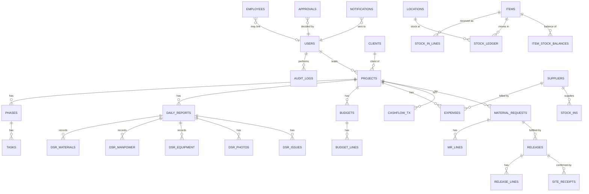

# 02 — Data Model

This is the canonical entity reference. Field tables use logical types; map them to your DB
(Postgres types shown in parentheses where useful). Conventions from
[00-overview.md](00-overview.md) §7 apply (snake_case, plural tables, `id` PK, `created_at`,
etc.).

Legend for field tables: **PK** primary key · **FK** foreign key · **U** unique · **N**
nullable · **idx** indexed.

---

## 1. Entity map (high level)

> Not every relationship is drawn (it would be unreadable). The field tables below are
> authoritative.

---

## 2. Core System

### 2.1 `users`
The login accounts.

| Field | Type | Notes |
|-------|------|-------|
| id | uuid **PK** | |
| email | string **U** **idx** | login identifier |
| password_hash | string | Argon2id/bcrypt; N if using external auth |
| full_name | string | |
| role | enum(`ADMIN`,`ENGINEER`) | coarse role; fine-grained perms via `role_permissions` |
| phone | string **N** | |
| is_active | boolean | inactive users cannot log in |
| employee_id | uuid **FK→employees** **N** | optional link to directory |
| last_login_at | timestamp **N** | |
| created_at / updated_at | timestamp | |
| deleted_at | timestamp **N** | soft delete |

### 2.2 `roles` & `permissions` (RBAC backing — see [03](03-roles-and-permissions.md))
Optional but recommended so roles can grow beyond the two enums.

`permissions(id, key, description)` — e.g. `project.create`, `expense.approve`.
`role_permissions(role, permission_id)` — which permissions each role has.

> v1 can ship with the two-role enum + a static permission map in code, then graduate to
> these tables when a third role appears. The permission *keys* should be defined from day one.

### 2.3 `audit_logs` (see [12](12-audit-trail.md))

| Field | Type | Notes |
|-------|------|-------|
| id | bigint **PK** | |
| actor_id | uuid **FK→users** **N** **idx** | null for system actions |
| action | string **idx** | e.g. `material_request.approved` |
| entity_type | string **idx** | e.g. `MaterialRequest` |
| entity_id | uuid **idx** | the affected row id (polymorphic; FK targets are all uuid) |
| summary | string | human-readable line |
| diff | jsonb **N** | before/after for key fields |
| ip / user_agent | string **N** | request context |
| created_at | timestamp **idx** | |

### 2.4 System Settings lookup tables
Admin-editable option lists. Each follows the same shape:

`(id, name, code U, sort_order, is_active, color N, created_at, updated_at)`

Lookup tables:
- `project_statuses` (e.g. Planning, Active, On Hold, Completed, Cancelled)
- `task_statuses` (e.g. Not Started, In Progress, Blocked, Done)
- `inventory_categories`
- `units` (unit of measure: pcs, kg, m, m³, bag, set …)
- `budget_categories`
- `expense_categories`
- `employee_trades` (Mason, Electrician, Foreman …)
- `cashflow_categories` (Client Payment, Supplier Payment, Equipment Rental …)

Plus a single-row-ish settings store:
- `app_settings(key U, value jsonb)` — timezone, currency, company info, SMTP defaults toggle,
  reorder behavior, etc.
- `notification_settings` — see [08](08-notifications.md).

---

## 3. Directory

### 3.1 `employees` (Workforce Directory)

| Field | Type | Notes |
|-------|------|-------|
| id | uuid **PK** | |
| full_name | string **idx** | |
| trade_id | uuid **FK→employee_trades** **N** | |
| phone / email | string **N** | |
| status | enum(`ACTIVE`,`INACTIVE`) | |
| notes | text **N** | |
| created_at / updated_at / deleted_at | | |

> Employees are a reference list (who reported, who received, who worked on site). Not every
> employee is a system user; a user may link to an employee via `users.employee_id`.

### 3.2 `clients`

| Field | Type | Notes |
|-------|------|-------|
| id | uuid **PK** | |
| name | string **idx** | |
| contact_person / phone / email / address | string **N** | |
| notes | text **N** | |
| created_at / updated_at / deleted_at | | |

Children: `client_documents(id, client_id FK, file_id FK, label, created_at)`,
`client_notes(id, client_id FK, body, created_by FK, created_at)`.
Project history is derived (projects where `client_id` matches).

### 3.3 `suppliers`

| Field | Type | Notes |
|-------|------|-------|
| id | uuid **PK** | |
| name | string **idx** | |
| contact_person / phone / email / address | string **N** | |
| tin / payment_terms | string **N** | |
| notes | text **N** | |
| created_at / updated_at / deleted_at | | |

---

## 4. Projects

### 4.1 `projects`

| Field | Type | Notes |
|-------|------|-------|
| id | uuid **PK** | |
| ref_code | string **U** | e.g. `PRJ-2026-0007` |
| name | string **idx** | |
| client_id | uuid **FK→clients** **idx** | |
| location | string **N** | site address |
| contract_amount | money | |
| start_date / target_end_date | date **N** | |
| actual_end_date | date **N** | set on completion |
| scope_of_work | text **N** | |
| lead_engineer_id | uuid **FK→users** **idx** | the assigned engineer |
| status_id | uuid **FK→project_statuses** **idx** | |
| progress_pct | decimal(5,2) | 0–100; derived from tasks or set manually |
| created_by | uuid **FK→users** | |
| created_at / updated_at / deleted_at | | |

Children: `project_documents(id, project_id FK, file_id FK, label, created_at)`.
A `project_members` table (project_id, user_id, role_on_project) supports multiple engineers
per project later; v1 may rely on `lead_engineer_id` only.

### 4.2 `phases`

| Field | Type | Notes |
|-------|------|-------|
| id | uuid **PK** | |
| project_id | uuid **FK→projects** **idx** | |
| name | string | |
| sequence | int | ordering |
| start_date / target_end_date | date **N** | |
| status_id | uuid **FK→task_statuses** | reuse task statuses or own enum |
| progress_pct | decimal(5,2) | derived from tasks |
| remarks | text **N** | |

### 4.3 `tasks`

| Field | Type | Notes |
|-------|------|-------|
| id | uuid **PK** | |
| phase_id | uuid **FK→phases** **idx** | |
| name | string | |
| assignee_id | uuid **FK→users** **N** | |
| start_date / due_date | date **N** | |
| completed_date | date **N** | |
| status_id | uuid **FK→task_statuses** **idx** | |
| progress_pct | decimal(5,2) | |
| is_delayed | boolean | derived: due_date < today and not done |
| remarks | text **N** | |

Children: `task_attachments(id, task_id FK, file_id FK, created_at)`.

### 4.4 Daily Site Reports
`daily_reports`

| Field | Type | Notes |
|-------|------|-------|
| id | uuid **PK** | |
| ref_code | string **U** | `DSR-2026-00231` |
| project_id | uuid **FK→projects** **idx** | |
| report_date | date **idx** | one per project per day (U: project_id+report_date) |
| weather | string **N** | |
| work_accomplished | text | |
| next_day_plan | text **N** | |
| progress_note | text **N** | |
| submitted_by | uuid **FK→users** | |
| submitted_at | timestamp | |
| status | enum(`DRAFT`,`SUBMITTED`) | |

Children:
- `dsr_manpower(id, daily_report_id FK, employee_id FK N, trade_id FK N, headcount int, hours decimal N)`
- `dsr_equipment(id, daily_report_id FK, name, quantity, hours decimal N, remarks N)`
- `dsr_materials(id, daily_report_id FK, item_id FK N, description N, quantity decimal, unit_id FK N)` — **drives "used" in issued/used/remaining**
- `dsr_photos(id, daily_report_id FK, file_id FK, caption N)`
- `dsr_issues(id, daily_report_id FK, description, severity enum, resolved boolean)`

> `dsr_materials` is the bridge between site reporting and inventory accounting. When an item
> is linked, it counts toward material *usage*. See [06](06-inventory-ledger.md) §6.

---

## 5. Finance (detail in [07](07-finance-design.md))

### 5.1 `budgets`
One active budget per project (versioned via `version`).

| Field | Type | Notes |
|-------|------|-------|
| id | uuid **PK** | |
| project_id | uuid **FK→projects** **idx** | |
| version | int | bump on revision |
| status | enum(`DRAFT`,`ACTIVE`,`SUPERSEDED`) | |
| total_amount | money | sum of lines (cached) |
| notes | text **N** | |
| created_by / created_at | | |

### 5.2 `budget_lines`

| Field | Type | Notes |
|-------|------|-------|
| id | uuid **PK** | |
| budget_id | uuid **FK→budgets** **idx** | |
| category_id | uuid **FK→budget_categories** | |
| description | string **N** | |
| planned_amount | money | |

### 5.3 `expenses`

| Field | Type | Notes |
|-------|------|-------|
| id | uuid **PK** | |
| ref_code | string **U** | `EXP-2026-00301` |
| project_id | uuid **FK→projects** **idx** | |
| category_id | uuid **FK→expense_categories** **idx** | |
| budget_line_id | uuid **FK→budget_lines** **N** | ties actual to planned |
| supplier_id | uuid **FK→suppliers** **N** | |
| description | string | |
| amount | money | |
| expense_date | date **idx** | |
| payment_status | enum(`UNPAID`,`PARTIAL`,`PAID`) | |
| approval_id | uuid **FK→approvals** **N** | |
| status | enum(`PENDING`,`APPROVED`,`REJECTED`) **idx** | only APPROVED counts as actual cost |
| created_by / created_at / updated_at | | |

Children: `expense_attachments(id, expense_id FK, file_id FK, kind enum('RECEIPT','INVOICE','OTHER'))`.

### 5.4 `cashflow_tx`

| Field | Type | Notes |
|-------|------|-------|
| id | uuid **PK** | |
| ref_code | string **U** | `CF-2026-00114` |
| project_id | uuid **FK→projects** **idx** **N** | N for firm-level entries |
| direction | enum(`IN`,`OUT`) **idx** | money in / out |
| category_id | uuid **FK→cashflow_categories** | |
| supplier_id / client_id | uuid **FK** **N** | counterparty |
| description | string | |
| amount | money | always positive; sign comes from `direction` |
| tx_date | date **idx** | |
| method | enum(`CASH`,`BANK`,`CHEQUE`,`OTHER`) **N** | |
| reference_no | string **N** | cheque/transaction no |
| created_by / created_at | | |

---

## 6. Approvals (detail in [04](04-modules.md) §5.12)

A single polymorphic approvals table gates many transaction types.

### 6.1 `approvals`

| Field | Type | Notes |
|-------|------|-------|
| id | uuid **PK** | |
| ref_code | string **U** | `APR-2026-00088` |
| type | enum(`MATERIAL_REQUEST`,`EXPENSE`,`BUDGET_ADJUSTMENT`,`INVENTORY_ADJUSTMENT`,`DAMAGE`,`WASTE`,`LOSS`) **idx** | `WASTE` added — waste movements require approval ([17](17-audit-decisions.md) §4) |
| entity_type | string | model name of the subject |
| entity_id | uuid **idx** | subject row id (polymorphic) |
| status | enum(`PENDING`,`APPROVED`,`REJECTED`,`CANCELLED`) **idx** | |
| requested_by | uuid **FK→users** | |
| requested_at | timestamp | |
| decided_by | uuid **FK→users** **N** | |
| decided_at | timestamp **N** | |
| decision_note | text **N** | reason, esp. for rejection |

> Pattern: the subject record (e.g. an expense) holds `approval_id`; the approval holds the
> decision. The subject's own `status` field is updated when the approval resolves. See the
> approval state machine in [05-core-flows.md](05-core-flows.md) §5.

---

## 7. Inventory (detail in [06](06-inventory-ledger.md))

### 7.1 `items` (Master Data)

| Field | Type | Notes |
|-------|------|-------|
| id | uuid **PK** | |
| sku | string **U** **N** | optional internal code |
| name | string **idx** | |
| category_id | uuid **FK→inventory_categories** **idx** | |
| unit_id | uuid **FK→units** | base unit of measure |
| reorder_level | decimal(14,3) | low-stock threshold |
| default_cost | money **N** | for valuation/estimates |
| preferred_supplier_id | uuid **FK→suppliers** **N** | |
| is_active | boolean | |
| created_at / updated_at / deleted_at | | |

### 7.2 `locations`

| Field | Type | Notes |
|-------|------|-------|
| id | uuid **PK** | |
| name | string **idx** | |
| type | enum(`WAREHOUSE`,`YARD`,`SITE`,`OTHER`) | |
| project_id | uuid **FK→projects** **N** | set when location IS a project site |
| is_active | boolean | |

### 7.3 `stock_ins` + `stock_in_lines`
`stock_ins(id, ref_code U 'SI-2026-00118', supplier_id FK N, location_id FK, received_by FK, received_at, invoice_no N, file_id FK N, notes N)`

`stock_in_lines(id, stock_in_id FK, item_id FK, quantity decimal, unit_cost money, unit_id FK)`

> Posting a stock-in writes one **positive** `stock_ledger` row per line. See [06](06-inventory-ledger.md).

### 7.4 `material_requests` + `mr_lines`
`material_requests(id, ref_code U 'MR-2026-00042', project_id FK, requested_by FK, needed_date date N, purpose text, status enum(DRAFT,PENDING,APPROVED,PARTIALLY_RELEASED,RELEASED,REJECTED,CANCELLED), approval_id FK N, created_at)`

`mr_lines(id, material_request_id FK, item_id FK, qty_requested decimal, qty_approved decimal N, qty_released decimal default 0, unit_id FK, note N)`

### 7.5 `releases` + `release_lines` + `site_receipts`
`releases(id, ref_code U 'REL-2026-00077', material_request_id FK, from_location_id FK, released_by FK, released_at, status enum(RELEASED,RECEIVED,DISCREPANCY), notes N)`

`release_lines(id, release_id FK, mr_line_id FK, item_id FK, qty_released decimal, unit_id FK)`

`site_receipts(id, release_id FK, received_by FK, received_at, status enum(OK,SHORT,OVER,DAMAGED), notes N, file_id FK N)`
with `site_receipt_lines(id, site_receipt_id FK, release_line_id FK, qty_received decimal, shortage_qty decimal, remark N)`

> Releasing posts **negative** ledger rows at the source location. Site receiving may post a
> matching positive row at the site location (if sites are tracked as locations) and flags
> shortages. See [06](06-inventory-ledger.md) §5.

### 7.6 `inventory_movements` (returns, transfers, damage, waste, loss, adjustments)
A request/record wrapper around movements that need approval or extra context.

| Field | Type | Notes |
|-------|------|-------|
| id | uuid **PK** | |
| ref_code | string **U** | `MOV-2026-00150` |
| type | enum(`RETURN`,`TRANSFER`,`DAMAGE`,`WASTE`,`LOSS`,`ADJUSTMENT`) **idx** | |
| item_id | uuid **FK→items** | |
| quantity | decimal(14,3) | always positive; ledger sign derived from type |
| from_location_id | uuid **FK→locations** **N** | source (transfer/return out, damage/waste/loss) |
| to_location_id | uuid **FK→locations** **N** | destination (transfer/return in) |
| project_id | uuid **FK→projects** **N** | context |
| reason | text **N** | required for damage/waste/loss/adjustment |
| status | enum(`PENDING`,`POSTED`,`REJECTED`) **idx** | adjustments/damage/loss need approval first |
| approval_id | uuid **FK→approvals** **N** | |
| file_id | uuid **FK** **N** | photo/proof |
| created_by / created_at | | |

### 7.7 `stock_ledger` (the source of truth — see [06](06-inventory-ledger.md))
**Append-only. Never updated or deleted.**

| Field | Type | Notes |
|-------|------|-------|
| id | bigint **PK** | |
| item_id | uuid **FK→items** **idx** | |
| location_id | uuid **FK→locations** **idx** | |
| movement_type | enum(`STOCK_IN`,`RELEASE`,`RECEIPT`,`RETURN`,`TRANSFER_OUT`,`TRANSFER_IN`,`DAMAGE`,`WASTE`,`LOSS`,`ADJUSTMENT`,`USAGE`) **idx** | |
| quantity | decimal(14,3) | **signed**: + adds, − removes |
| unit_cost | money **N** | snapshot for valuation |
| source_type | string **idx** | originating model (`StockIn`,`Release`,`InventoryMovement`,`DailyReport`) |
| source_id | uuid **idx** | originating row id (polymorphic) |
| project_id | uuid **FK** **N** **idx** | for project material reports |
| actor_id | uuid **FK→users** | who caused it |
| occurred_at | timestamp **idx** | business time of the movement |
| created_at | timestamp | system insert time |

### 7.8 `item_stock_balances` (cache, rebuildable)
Fast current-quantity lookup; **always reconstructable** by summing `stock_ledger`.

`(item_id FK, location_id FK, quantity decimal, updated_at)` with **U(item_id, location_id)**.

---

## 8. Files & Notifications

### 8.1 `files`
Central metadata for every upload (photos, receipts, documents).

`(id, storage_key U, original_name, mime_type, size_bytes, uploaded_by FK, created_at)`

Other tables reference `file_id`; join tables (e.g. `dsr_photos`) link many files to a parent.

### 8.2 `notifications` (see [08](08-notifications.md))

| Field | Type | Notes |
|-------|------|-------|
| id | uuid **PK** | |
| event_key | string **idx** | e.g. `material_request.approved` |
| recipient_id | uuid **FK→users** **idx** | |
| channel | enum(`EMAIL`,`IN_APP`) | |
| subject / body | text | rendered content |
| entity_type / entity_id | string **N** | deep-link target |
| status | enum(`QUEUED`,`SENT`,`DELIVERED`,`BOUNCED`,`COMPLAINED`,`FAILED`,`READ`) **idx** | delivery states set by Resend webhook ([17](17-audit-decisions.md) §4) |
| error | text **N** | last send error |
| attempts | int | retry counter |
| sent_at / read_at | timestamp **N** | |
| created_at | timestamp **idx** | |

---

## 9. Reference-code counters
To generate `MR-2026-00042` safely under concurrency.

`ref_counters(scope string, period string, value int)` with **U(scope, period)** — e.g.
`('MR','2026', 42)`. Increment inside the same transaction as the insert (or via an atomic
`UPDATE ... RETURNING`). See [01](01-architecture.md) §5.6.

---

## 10. Indexing & integrity checklist

- FK columns used in filters get indexes (`project_id`, `item_id`, `location_id`, `status`,
  `created_at`).
- Composite uniques: `daily_reports(project_id, report_date)`,
  `item_stock_balances(item_id, location_id)`, `ref_counters(scope, period)`.
- `stock_ledger`: composite index `(item_id, location_id, occurred_at)` for balance/ledger
  queries; `(source_type, source_id)` for traceability lookups.
- `CHECK` constraints: `quantity >= 0` on request/movement quantities (signing happens in the
  ledger), `amount >= 0` on money, `progress_pct BETWEEN 0 AND 100`.
- All money columns one type, one currency (see [07](07-finance-design.md)).
- Foreign keys `ON DELETE RESTRICT` for transactional links; soft-delete masters instead of
  hard-deleting.
