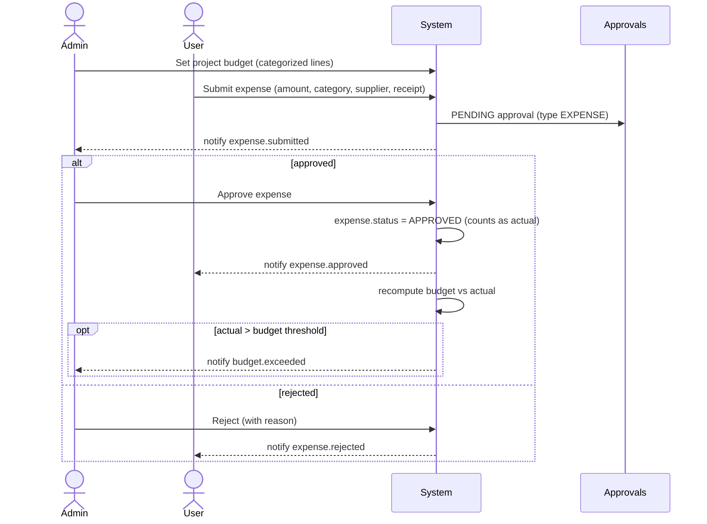
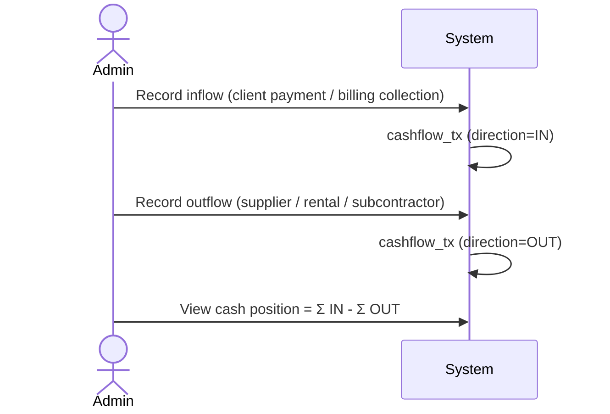
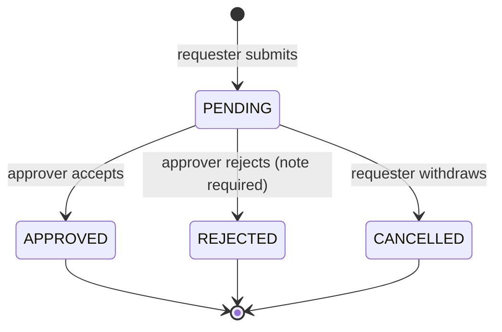
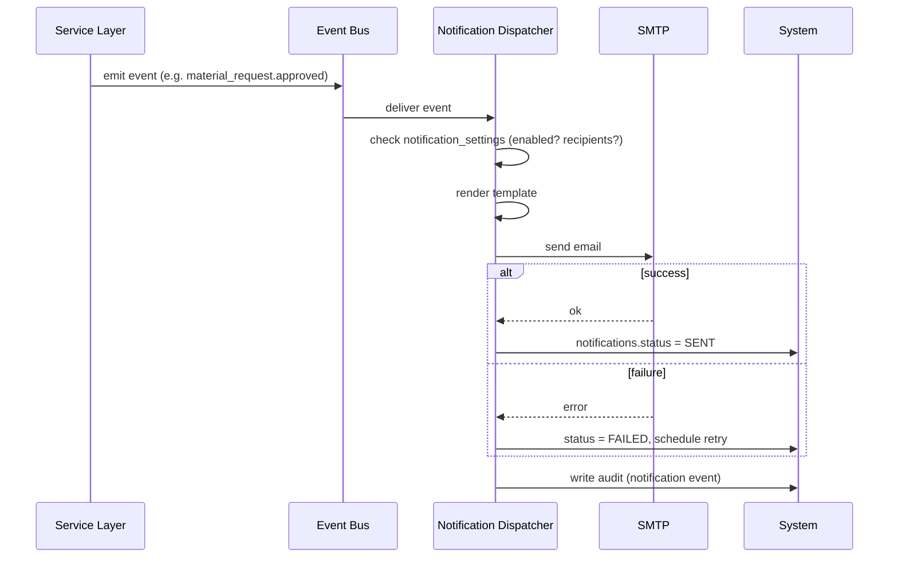

# 05 — Core Flows

End-to-end process flows. Each shows the actors, the steps, the state changes, and the rows
written. These are the "happy paths" plus their key branches; exact field rules live in the
module specs ([04](04-modules.md)) and ledger design ([06](06-inventory-ledger.md)).

---

## 1. Project flow

```mermaid
sequenceDiagram
    actor Admin as Admin / GM / OM
    actor Eng as Engineer team (lead + members)
    actor QA as QA/QC Engineer
    Admin->>System: Create project (client, contract, dates, scope)
    Admin->>System: Assign engineer TEAM (project_members: lead + members)
    System-->>Eng: Project appears on each member's dashboard
    Eng->>System: Create / update phases & tasks (task.manage, scoped)
    loop Each site day
        Eng->>System: Submit Daily Site Report
        System->>System: Roll up progress (on write); flag DSR materials for Stage-3 usage
        System-->>Admin: notify dsr.submitted
    end
    Note over Eng,QA: Deferred (post-Stage-2): inspection module
    Eng->>System: Request inspection (names a QA/QC engineer)
    System-->>QA: notify inspection.requested + grant INSPECTOR scope
    QA->>System: Record result (PASS / FAIL→rework)
    System-->>Eng: notify inspection.recorded
    System->>System: Daily job flags delayed tasks
    System-->>Admin: notify task.delayed
    Admin->>System: Mark project Completed (sets actual_end_date)
```

**Client workflow → our roles & stages.** The firm's end-to-end process maps as:

1. _Admin / GM / OM create projects & tasks_ → GM/OM are **`ADMIN`** ([03](03-roles-and-permissions.md) §1);
   Admin creates the project and assigns the **engineer team** (lead + members).
2. _Engineers update / create tasks_ → assigned engineers hold **`task.manage`** scoped to their
   projects (**Stage 2**); the whole team has equal task authority.
3. _Request orders to purchasing_ → the **Material Request** flow (Engineer raises → Admin
   approves), **Stage 3** ([04](04-modules.md) §5.16) — "purchasing" is not a separate role.
4. _Request inspection from QA/QC_ → the **Inspections** module (**deferred, post-Stage-2**,
   [04](04-modules.md) §5.10a); the request **names + notifies** a QA/QC engineer and grants them
   scoped `INSPECTOR` access. The `QA_QC_ENGINEER` role + scoping themselves ship in Stage 2.
5. _Submit/upload billing docs → Finance check_ → **Stage 4** finance, **out of scope** here.

**Writes:** `projects`, `project_members`, `phases`, `tasks`, `daily_reports`(+children),
`audit_logs`, `notifications`. (The `−USAGE` ledger posting is **Stage 3** — Stage 2 only reserves
the `dsr_materials` → ledger link, [17](17-audit-decisions.md) §10.4. `inspection_requests` is
**reserved, post-Stage-2** — [02](02-data-model.md) §4.5.)

**Branches:** task past due → `is_delayed` + `task.delayed`; high-severity DSR issue →
`dsr.issue.flagged`; inspection result `FAILED` → task `REWORK` (deferred).

---

## 2. Inventory flow (the core loop)

```mermaid
sequenceDiagram
    actor Admin
    actor Eng as Engineer
    Admin->>System: Record Stock-In (item, supplier, qty, cost, location)
    System->>Ledger: +STOCK_IN row, balance += qty
    Eng->>System: Create Material Request (project, items, qty)
    System->>Approvals: PENDING approval
    System-->>Admin: notify material_request.submitted
    Admin->>System: Approve MR (set qty_approved)
    System-->>Eng: notify material_request.approved
    Admin->>System: Record Release (from location, qty)
    System->>Ledger: -RELEASE row, balance -= qty
    System->>System: mr_lines.qty_released += qty
    Eng->>System: Confirm Site Receiving (qty received, shortage?)
    System->>Ledger: +RECEIPT row at site (if tracked)
    alt shortage
        System->>System: open discrepancy; raise LOSS/DAMAGE (→ approval)
        System-->>Admin: notify receiving.discrepancy
    end
    Eng->>System: DSR records materials used
    System->>Ledger: -USAGE row
    System->>Reports: issued vs used vs remaining updated
```

**State on the MR:** `PENDING → APPROVED → PARTIALLY_RELEASED → RELEASED`.
**Writes:** `stock_ins`, `material_requests`, `releases`, `site_receipts`,
`inventory_movements`(on shortage), `stock_ledger`, `item_stock_balances`, `approvals`,
`notifications`, `audit_logs`.

> Stock changes **only** via ledger postings. Balances are updated in the same transaction as
> the ledger insert. See [06](06-inventory-ledger.md).

---

## 3. Budget & expense flow



**Writes:** `budgets`, `budget_lines`, `expenses`(+attachments), `approvals`, `notifications`,
`audit_logs`. Only `APPROVED` expenses feed budget-vs-actual and the dashboard.

---

## 4. Cash flow flow



**Writes:** `cashflow_tx`, `audit_logs`. Cash position computed per project and firm-wide.

---

## 5. Approval state machine (shared)



**On `APPROVED`, in one DB transaction**, the approval's *effect* is applied based on `type`:

| Approval type | Effect on approval |
|---------------|--------------------|
| `MATERIAL_REQUEST` | MR becomes releasable; `qty_approved` set; no stock moved yet |
| `EXPENSE` | expense.status → APPROVED; counts as actual cost |
| `BUDGET_ADJUSTMENT` | new budget version becomes ACTIVE; prior SUPERSEDED |
| `INVENTORY_ADJUSTMENT` | post signed `ADJUSTMENT` ledger row; balance corrected |
| `DAMAGE` / `LOSS` | post negative ledger row; balance reduced |

Each transition writes an `audit_logs` row and emits `approval.decided`.

---

## 6. Notification flow (cross-cutting)



The originating action commits **before/independently of** email delivery — a down SMTP server
never blocks an approval or report submission. See [08](08-notifications.md).

---

## 7. Issued vs Used vs Remaining (how the numbers tie out)

For a project + item:

```
Issued    = Σ release_lines.qty_released to that project's sites
Received  = Σ site receipts (confirmed at site)
Used      = Σ dsr_materials.quantity (USAGE ledger rows) for the project
Returned  = Σ RETURN movements from the project's site
Remaining = Received − Used − Returned
Shortage  = Issued − Received
```

This is computed from the ledger + DSR usage, not stored, so it is always reconcilable. Drives
the "Materials issued vs used vs remaining" and "Project used materials" reports
([09](09-reports-and-export.md)).
