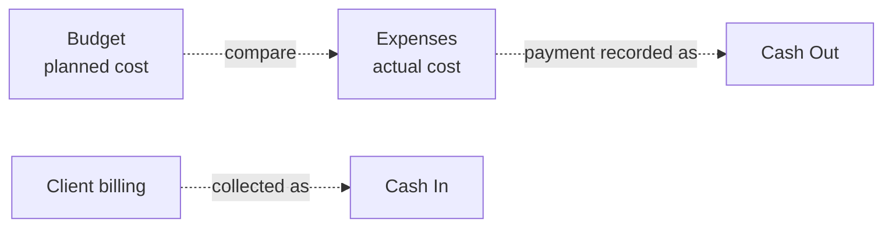

# 07 — Finance Design

Three related but distinct concerns: **Budget** (planned cost), **Expenses** (actual cost), and
**Cash Flow** (money movement). Keeping them distinct is what makes the numbers honest.

## 1. Money representation (non-negotiable)

- **Never use floats** for money. The representation is locked ([17](17-audit-decisions.md) §3):
  `DECIMAL(14,2)` in the DB + a `Money` value object in code (a Drizzle custom `money` type defined
  once). **Not** integer minor units — that fork is closed.
- One **base currency** firm-wide (v1); store the currency code in `app_settings` for display.
- Centralize all money math in `lib/money.ts` (add, subtract, sum, percentage, format). No ad-hoc
  arithmetic in components or queries.
- Rounding rule defined once (round half-up to 2 decimals) and applied consistently.

## 2. Budget

```
projects 1───* budgets (versioned) 1───* budget_lines (per category)
```

- A project has one **ACTIVE** budget; revisions create a new `version`, set the old to
  `SUPERSEDED`. Revising is a `BUDGET_ADJUSTMENT` approval ([5.13](04-modules.md)).
- `budget_lines` break the total by `budget_category` (Materials, Labor, Equipment, Subcon,
  Permits, Overhead…). `total_amount` on the budget is the cached sum of its active lines.
- The **contract amount** (on the project) is the client price; the **budget** is planned cost.
  Margin ≈ contract − budget. Keep them separate.

## 3. Expenses → actual cost

- An expense is `PENDING` until approved; **only `APPROVED` expenses count as actual cost.**
- Optional `budget_line_id` ties an actual to a planned line for per-category variance.
- Receipt/invoice attachments stored in object storage.
- `payment_status` (UNPAID/PARTIAL/PAID) tracks whether the cost has been *paid* — separate
  from whether it's *approved*. (Approval = "this is a real project cost"; payment = "we've paid
  it," recorded in cash flow.)

### Budget vs Actual (per project)

| Metric | Formula |
|--------|---------|
| Planned (total) | Σ active `budget_lines.planned_amount` |
| Planned (category) | Σ planned_amount WHERE category |
| Actual (total) | Σ `expenses.amount` WHERE status=APPROVED |
| Actual (category) | Σ approved expenses WHERE category |
| Variance | Planned − Actual (negative = over budget) |
| % Used | Actual / Planned × 100 |

Drives the "Budget vs actual" report ([09](09-reports-and-export.md)) and the dashboard budget-
usage card. A configurable threshold (e.g. 90%, 100%) fires `budget.exceeded`
([08](08-notifications.md)).

## 4. Cash Flow

Tracks **money in and out**, which is *not the same as cost*.

- `cashflow_tx.direction` is `IN` or `OUT`; `amount` is always positive.
- **IN:** client payments, progress-billing collections, other receipts.
- **OUT:** supplier payments, equipment rental, subcontractor payments, other disbursements.
- Optional links to project, client, supplier; `method` and `reference_no` for traceability.

### Cash position

| Metric | Formula |
|--------|---------|
| Total In (scope) | Σ amount WHERE direction=IN |
| Total Out (scope) | Σ amount WHERE direction=OUT |
| Net / Cash Position | Total In − Total Out |
| Running balance | cumulative Net ordered by `tx_date` |

Scope = a project or firm-wide. Drives the cash-flow report and the dashboard cash-position
card.

## 5. How the three relate (and why they're separate)



- **Budget vs Expense** answers: *are we within planned cost?*
- **Cash Flow** answers: *do we have money on hand / is the project cash-positive?*
- A project can be **under budget but cash-negative** (client hasn't paid yet) — leadership
  needs both views. Merging them hides exactly the problem the firm wants to see.

> **Optional link:** if the firm wants "paying an approved expense" to auto-create a matching
> cash OUT, support it as an explicit action ("Record payment") that creates a `cashflow_tx`
> referencing the expense and updates `payment_status`. Keep the records separate underneath.

## 6. Approvals in finance

- **Expense:** approval gates whether it counts as actual cost.
- **Budget adjustment:** approval gates whether a new budget version goes ACTIVE.
- Both use the shared `approvals` table and state machine ([05](05-core-flows.md) §5). Rejections
  require a note; everything is audited.

## 7. Edge cases to handle

- Editing an **approved** expense should require re-approval (or be blocked); silent edits to
  approved costs undermine trust — audit-log any change.
- Deleting an expense: prefer **void/cancel** (status) over hard delete, so history holds.
- Negative variance and over-threshold usage are surfaced, not hidden.
- Currency/timezone changes are guarded admin actions.
- Partial payments: track via `payment_status=PARTIAL` and multiple cash-OUT rows referencing
  the expense.

## 8. Reports fed by finance

Budget vs actual · Expense report · Cash flow report (all in [09](09-reports-and-export.md)),
plus dashboard cards: budget usage, total expenses, cash position.
