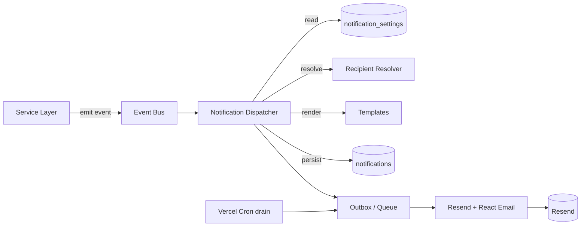

# 08 — Notifications & Email (SMTP)

## 1. Design principles

1. **Event-driven.** Domain services emit events; they do not call the mailer directly. A
   dispatcher turns events into notifications.
2. **Decoupled from the request.** Sending email must never block or roll back the action that
   triggered it. A down SMTP server cannot stop an approval.
3. **Configurable.** Admin controls, per event, whether it notifies, who, and how (immediate vs
   digest).
4. **Recorded & retried.** Every notification is persisted with status; failures retry with
   backoff and are visible.

## 2. Architecture

- **Event bus:** in-process emitter for v1 (a function that records the event and hands it to
  the dispatcher); upgrade to **Vercel Queues** if volume grows (no separate worker to run).
- **Outbox pattern:** the dispatcher writes the `notifications` row (`QUEUED`) in/near the same
  transaction as the action, then a worker sends it. This guarantees "we decided to notify" is
  durable even if the mailer is momentarily down.
- **Retry worker:** a **Vercel Cron route** (serverless has no long-running worker) drains
  `QUEUED`/`FAILED` rows under the attempt cap with exponential backoff. Protected by
  `CRON_SECRET`. See [16-tech-decisions.md](16-tech-decisions.md) §6.

## 3. Event catalog

| Event key | Fired when | Default recipients |
|-----------|-----------|--------------------|
| `material_request.submitted` | Engineer submits MR | Admins / approvers |
| `material_request.approved` | MR approved | Requesting engineer |
| `material_request.rejected` | MR rejected | Requesting engineer |
| `material_request.released` | Stock released for MR | Requesting engineer |
| `receiving.discrepancy` | Site receipt has shortage/damage | Admins |
| `expense.submitted` | Expense submitted | Approvers |
| `expense.approved` / `.rejected` | Expense decided | Submitter |
| `budget.exceeded` | Actual crosses threshold of budget | Admins, lead engineer |
| `approval.pending` | Any approval created | Approvers |
| `task.delayed` | Task overdue & not done (daily job) | Lead engineer, admins |
| `phase.critical_update` | Admin flags a phase critical | Lead engineer |
| `dsr.submitted` | Daily site report submitted | Admins |
| `dsr.issue.flagged` | High-severity issue in a DSR | Admins |
| `inspection.requested` _(post-Stage-2)_ | Engineer requests an inspection | The named QA/QC engineer (`USER:assigned_to`) |
| `inspection.recorded` _(post-Stage-2)_ | QA/QC records a pass/fail result | Requesting engineer (`USER:requested_by`) |
| `stock.low` | Item balance ≤ reorder level | Admins (inventory) |
| `user.created` | New account created | The new user (welcome) |
| `auth.login.failed` (×N) | Repeated failed logins | Admins (security) |

> The catalog is data-driven: each key has a row in `notification_settings`. Adding a new event
> means adding a key + template, not rewiring the dispatcher.

## 4. `notification_settings`

Per event key:

| Field | Meaning |
|-------|---------|
| event_key | the event |
| enabled | master on/off |
| channels | EMAIL, IN_APP (one or both) |
| recipient_rule | `ROLE:ADMIN`, `PROJECT:*` (all `project_members`) / `PROJECT:LEAD`, `USER:<field>`, or explicit list ([17](17-audit-decisions.md) §10.8) |
| mode | `IMMEDIATE` or `DIGEST` |
| digest_window | for DIGEST: e.g. daily 7:00 |

Recipient resolution combines role-based and context-based rules (e.g. `task.delayed` → the
project's `project_members` + all admins), de-duplicated and **excluding the actor** who triggered
the event plus inactive users ([17](17-audit-decisions.md) §10.8). `PROJECT:*` resolves via
`project_members`; `role_on_project` distinguishes `PROJECT:LEAD` from all members.

> **Reserved (post-Stage-2).** The inspection events reuse the existing `USER:<field>` rule —
> `inspection.requested` → `USER:assigned_to` (the QA/QC engineer named on the request),
> `inspection.recorded` → `USER:requested_by`. If the firm later prefers a QA/QC *pool* (anyone
> can pick up the request) instead of a named assignee, add a `ROLE:QA_QC_ENGINEER` rule then.
> Note the `INSPECTOR` member added by the request should be **excluded** from routine
> `project.*` / `dsr.*` traffic to avoid noise ([17](17-audit-decisions.md) §10 addendum #12, #15).

## 5. Templates (React Email)

- Templates are **React Email components** (`@react-email/components`) in `src/emails/`,
  rendered to HTML server-side and sent via **Resend**. Props are typed
  (`{ projectName, refCode, actorName, link }`) — no stringly-typed placeholders.
- Every email includes a deep link back into the app (`APP_BASE_URL` + entity route) and the
  firm's name/logo.
- React Email emits a plain-text alternative automatically for deliverability.
- A shared layout component (header/logo/footer) keeps all templates consistent; preview them
  locally with the React Email dev server.

## 6. Digests

For high-frequency, low-urgency events (e.g. `dsr.submitted`, some `task.delayed`), a scheduled
job aggregates the day's items into one email per recipient ("Daily summary: 4 reports, 2
delayed tasks, 1 low-stock item") with links. Reduces noise; configurable per event.

## 7. Delivery (Resend)

- Transport via the **Resend SDK** (`RESEND_API_KEY`, `EMAIL_FROM`). Resend also exposes an
  **SMTP endpoint** (`smtp.resend.com`) if a true SMTP protocol is ever required — the proposal's
  "SMTP" requirement is satisfied either way ([16](16-tech-decisions.md) §4).
- **Test panel** in Settings: send a test email to verify config without waiting for an event.
- Local dev uses a Resend test key / sandbox domain so no real mail reaches clients.
- Verify the firm's sending domain in Resend (**SPF/DKIM/DMARC**) for deliverability
  ([13](13-non-functional.md)).
- Pass a Resend **idempotency key** on send to reinforce the dispatcher's de-dup (§8).

## 8. Failure handling

- Send failure → `notifications.status = FAILED`, increment `attempts`, store `error`, schedule
  retry (e.g. 1m, 5m, 30m, give up after N).
- A persistent failure surfaces in an admin "notification health" view; the source action
  remains committed.
- **Resend webhooks** (`delivered`, `bounced`, `complained`) update `notifications.status`
  beyond the initial send — so a bounce/complaint is visible, not assumed-delivered.
- Idempotency: the dispatcher de-dupes so one logical event can't produce duplicate emails (key
  on event + entity + recipient + window), reinforced by a Resend idempotency key.

## 9. In-app notifications (lightweight, recommended)

The same `notifications` rows with `channel=IN_APP` power a bell/inbox in the header (unread
count, mark-as-read, deep links). Cheap to add since the model already exists, and it covers
users who don't check email promptly.

## 10. Audit linkage

Every notification send is recorded ([12](12-audit-trail.md)) — "Notification flow" in the
proposal requires the event to be logged in activity logs. The `notifications` table plus an
`audit_logs` entry on send satisfies this.
