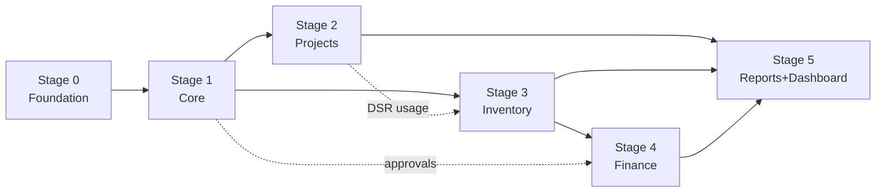

# 14 — Implementation Roadmap

The proposal's 5 stages, broken into buildable work with acceptance criteria. Each stage ends
in something demonstrable. Build **vertically** (DB → service → API → UI for one module) rather
than horizontally, so each stage produces working software.

> Durations are relative effort, not commitments — set real dates with the team. The sequence
> matters more than the estimates: later stages depend on earlier ones.

## Stage 0 — Foundation (before feature work)

The scaffolding everything else stands on.

- [ ] Repo, TypeScript, lint/format, commit hooks.
- [ ] Next.js app shell, base layout, design tokens, component primitives ([01](01-architecture.md) §4).
- [ ] Neon Postgres (Vercel Marketplace) + **Drizzle**; generate the **full schema**
      ([02](02-data-model.md)) up front even if features land later (avoids painful migrations).
      Wire the **transaction-capable driver** (`postgres-js`) — verify `db.transaction()` works
      ([16](16-tech-decisions.md) §2).
- [ ] **Better Auth** (Drizzle adapter): user model extended with `role`/`is_active`/
      `employee_id`, signup disabled, admin plugin for provisioning.
- [ ] Core libs: `db` (Drizzle client), `auth` (Better Auth), `rbac`, `events`, `mailer`
      (Resend + React Email), `storage` (R2 presigned), `money`, `refcodes`, `audit`
      ([01](01-architecture.md) §4).
- [ ] Seed script: master-data defaults + first admin user.
- [ ] Local dev: Neon branch (or local Postgres) + R2 dev bucket + Resend test key.
- [ ] Vercel project linked; env vars set ([16](16-tech-decisions.md) §8); preview + production;
      Neon backups verified; `CRON_SECRET` configured.

**Done when:** the app boots, an admin can log in (seeded), and an empty authenticated shell
renders. CI runs type-check/lint/build green.

---

## Stage 1 — Setup & Core System
**Modules:** Auth (5.1), Audit (5.2), Settings (5.3), Notifications scaffold (5.4),
Directory (5.5–5.7).

- [ ] **Auth & RBAC:** login/logout, session, permission guard, project-scope helper, user
      management (admin), deactivate.
- [ ] **Audit trail:** `audit()` helper wired into the service layer; global viewer + per-entity
      history panel component.
- [ ] **System settings:** app/company settings + notification settings only. Option lists
      (statuses, categories, units, trades) are **fixed in code** — no lookup-table managers
      ([17](17-audit-decisions.md) §9); ship `src/lib/lookups.ts` + `src/lib/statuses.ts`.
- [ ] **Notifications scaffold:** event bus, dispatcher, `notifications` table, Resend mailer +
      React Email + test panel, outbox + **Vercel Cron drain**, notification settings UI.
      (Specific events wired as their modules land.)
- [ ] **Directory:** employees, clients (with documents/notes tabs), suppliers — full CRUD with
      soft-delete.
- [ ] **File upload** pipeline (R2 presigned PUT/GET + `files` table + mime/size guards).

**Done when:** admin manages users, settings, and directory data; a test email sends via Resend
and is recorded; every action shows in the audit trail; RBAC matrix tests pass.

---

## Stage 2 — Project Tracking
**Modules:** Projects (5.8), Phases & Tasks (5.9), Daily Site Reports (5.10) + project
notifications.

- [ ] **Projects:** CRUD, client assignment, **engineer team assignment via `project_members`**
      (one lead + multiple member engineers; the access grant), documents, status lifecycle
      (validated state machine), **progress roll-up on write** (manual pin via
      `progress_is_manual`), project detail hub shell.
- [ ] **Engineer scoping live:** a centralized `assertProjectAccess` guard on writes + membership-
      baked read queries so engineers see only assigned projects everywhere; a guessed id returns
      404, not data ([17](17-audit-decisions.md) §10.2).
- [ ] **Phases & tasks:** hierarchy, dates, derived status, on-write progress roll-up, and the
      daily `task.delayed` job driven by the stored `is_delayed` transition flag
      ([17](17-audit-decisions.md) §10.3, §10.7). **Assigned engineers create/manage tasks**
      (scoped `task.manage`), not just update progress.
- [ ] **Daily site reports:** multi-section form (weather, work, manpower, equipment, materials,
      photos, issues, next-day plan), **collision-safe create**, draft autosave + **photo
      upload-on-pick**, one-per-day constraint, photo gallery ([17](17-audit-decisions.md) §10.5–10.6).
- [ ] **Notifications wired:** `project.*`, `task.delayed`, `dsr.submitted`,
      `phase.critical_update`, `dsr.issue.flagged` — `PROJECT:*` resolved via `project_members`,
      **the actor excluded** from recipients ([17](17-audit-decisions.md) §10.8).
- [ ] **QA/QC role + scoping (not the module):** add the `QA_QC_ENGINEER` role, the reserved
      `inspection.*` permission keys, and the `project_members.role_on_project = 'INSPECTOR'`
      value ([03](03-roles-and-permissions.md) §1–4, [17](17-audit-decisions.md) §10). **The
      inspection module itself (request → inspect → pass/fail → rework) is deferred** — specced
      at [04](04-modules.md) §5.10a, wired post-Stage-2, like the DSR→ledger stub.

**Done when:** admin creates a project and assigns a team of engineers, one of whom submits a DSR; delayed
tasks are flagged and notify; the project hub shows progress, reports, and team. (Material usage
posting is finalized once inventory exists in Stage 3 — stub the link now.)

---

## Stage 3 — Inventory Tracking
**Modules:** Master Data (5.14), Stock-In (5.15), Material Requests (5.16), Release & Receiving
(5.17), Movements & Adjustments (5.18), Ledger (5.19).

> This is the most technically demanding stage. Build the **ledger engine first**, then layer
> operations on top. ([06](06-inventory-ledger.md) is the spec.)

- [ ] **Ledger engine:** `postMovement()` domain function (signed qty, source, actor) +
      transactional balance update + append-only enforcement. Unit-test exhaustively.
- [ ] **Reconciliation job:** rebuild balances from ledger; report drift.
- [ ] **Master data:** items (reorder level, category, unit, cost, preferred supplier),
      locations (incl. site locations linked to projects).
- [ ] **Stock-in:** form + posting (+STOCK_IN), valuation snapshot, low-stock clear.
- [ ] **Material requests:** create (engineer, scoped), approve/reject (admin), qty_approved.
- [ ] **Release & receiving:** release against approved MR (−RELEASE, stock check), partial
      release, site receiving (+RECEIPT, shortage → discrepancy/LOSS), proof uploads.
- [ ] **Movements:** return, transfer (paired), damage/waste/loss (approval-gated), adjustment
      (approval-gated, reason required).
- [ ] **DSR usage link finalized:** submitting a DSR posts −USAGE per the chosen policy
      ([06](06-inventory-ledger.md) §6).
- [ ] **Ledger/traceability UI:** item ledger with running balance + source deep-links; project
      material trail; global movement search.
- [ ] **Low-stock detection** + `stock.low` notification.

**Done when:** the full inventory loop works end-to-end (stock-in → request → approve → release →
receive → use), every step posts correct ledger rows, balances reconcile, and the item ledger
shows the complete attributable history.

---

## Stage 4 — Financial Tracking
**Modules:** Budget & Expenses (5.11), Cash Flow (5.12), Approvals (5.13 — unify what earlier
stages stubbed).

- [ ] **Approvals unified:** one inbox + state machine + transactional effects across
      MR / expense / budget-adjustment / inventory-adjustment / damage / loss
      ([05](05-core-flows.md) §5). Refactor Stage 3 movement approvals onto it.
- [ ] **Budgets:** categorized lines, totals, versioned revisions (budget-adjustment approval).
- [ ] **Expenses:** create with receipt upload, approval gating, only-approved-counts,
      budget-line linkage, payment status, `budget.exceeded` alert.
- [ ] **Cash flow:** IN/OUT entries, categories, counterparties, cash position + running balance
      (project & firm-wide).
- [ ] **Optional:** "Record payment" linking an approved expense to a cash-OUT.

**Done when:** budget vs actual is correct per project (only approved expenses), cash position
computes from IN/OUT, and all finance approvals flow through the single inbox with full audit.

---

## Stage 5 — Reports, Dashboard & Hardening
**Modules:** Reports & Export (5.20), Dashboard (5.21), full notification wiring, testing,
refinement.

- [ ] **Report shell** + all 12 reports ([09](09-reports-and-export.md)) with filters and scope.
- [ ] **Exports:** PDF, Excel, CSV matching on-screen data; large-export streaming.
- [ ] **Dashboard:** role-aware widgets ([10](10-dashboard.md)) reusing report queries; empty/
      loading/error states; deep links.
- [ ] **Notifications:** verify every event in the catalog ([08](08-notifications.md)); digests.
- [ ] **Hardening:** security pass (authz/scope/headers/rate limits), reconciliation + backup
      restore drill, performance/index review, accessibility pass.
- [ ] **Testing:** unit (ledger, money, approvals), integration (core flows), e2e (Playwright)
      on the four main flows, RBAC matrix tests.
- [ ] **Docs:** user guide (admin + engineer) and the operational runbook
      ([13](13-non-functional.md) §10).

**Done when:** every report and dashboard widget matches its data and exports correctly, all
core flows pass e2e, security/backup/reconciliation are verified, and the user guide ships.

---

## Cross-cutting "definition of done" (every module)

- Server-side validation + authorization + scope.
- Transactions around multi-row writes; audit row on state changes.
- In-flight button state; no double-submit (firm rule).
- Designed empty/loading/error states.
- Type-check, lint, build green; tests for the module's rules.
- No dead code, no commented-out blocks, no unused imports (firm hygiene rules).

## Sequencing dependencies (don't reorder these)

- Approvals are stubbed in Stage 3 (movements) and unified in Stage 4 — plan for the refactor.
- DSR material usage (Stage 2) is finalized once the ledger exists (Stage 3).
- Reports/dashboard come last because they aggregate everything before them.

## Suggested team & cadence

- Small team (1–3 devs): build stages sequentially; demo at each stage boundary to the firm.
- Larger team: Stages 2 and 3 can partly parallelize after Stage 1, given the dependency notes.
- **Demo + UAT at each stage** — especially the inventory loop (Stage 3) and finance (Stage 4),
  the areas where the firm's real process must be validated against the model.
